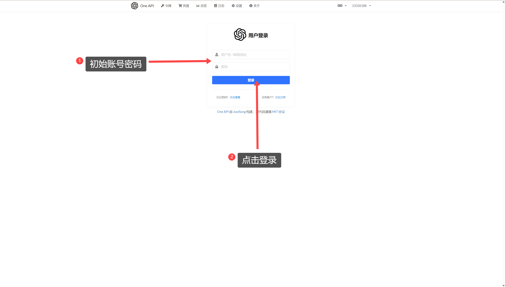
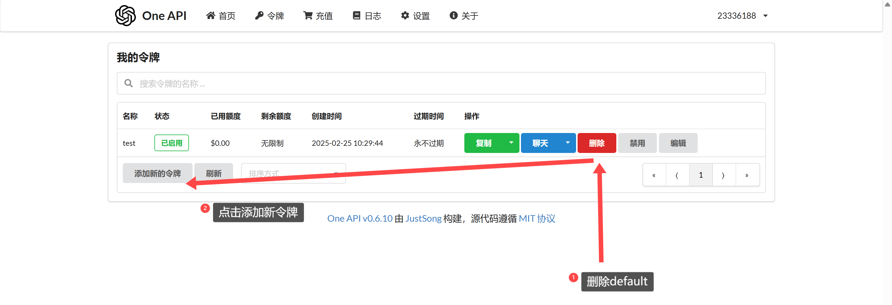
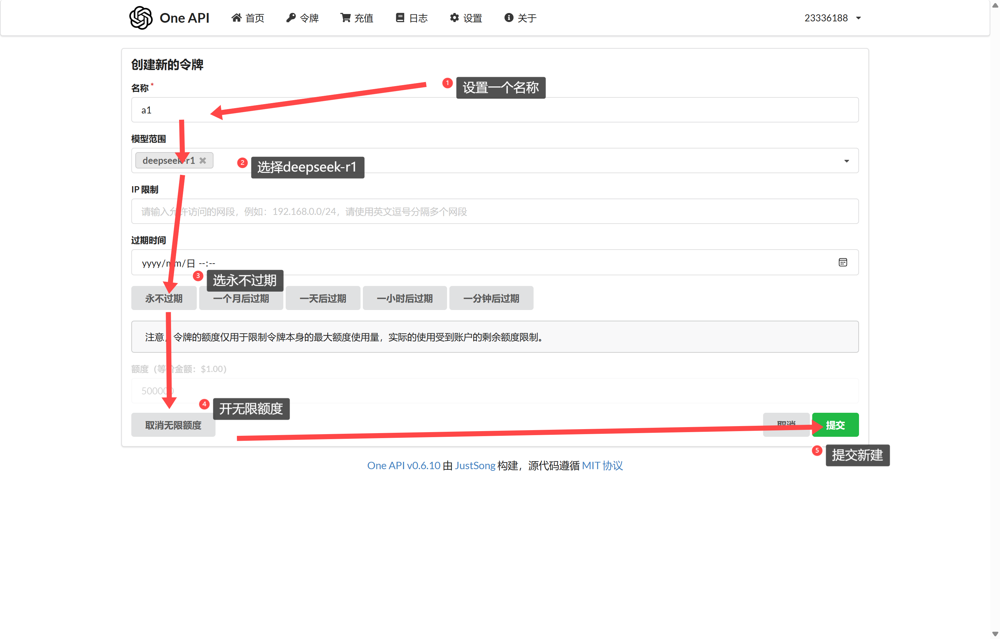
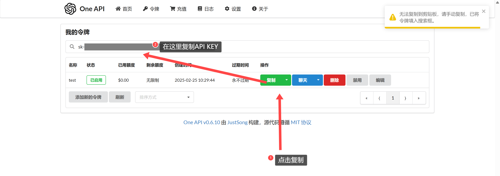
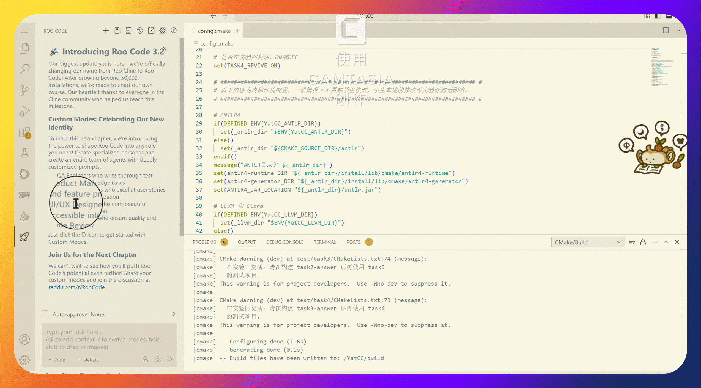
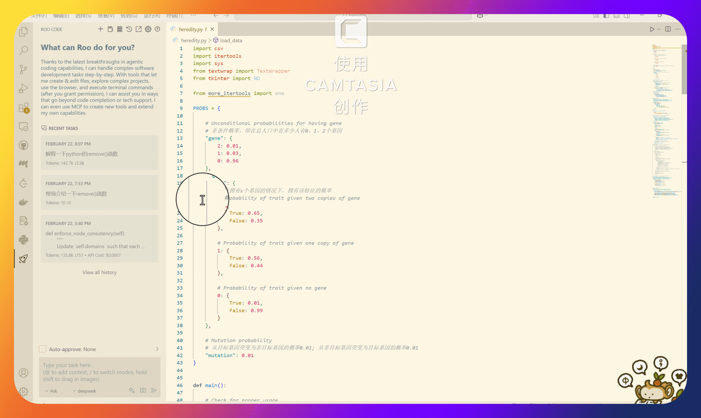

# AI工具配置与使用方法

为了给同学们提供一个智能化的开发体验，我们在天河星逸超级计算机上部署了 **Deepseek-R1** 模型供大家进行调用。本文分为三个部分，将从注册API开始，逐步讲解如何全面使用便捷、智能的模型辅助服务。

## 目录

- [第一部分：API-Key注册](#第一部分api-key注册)
- [第二部分：Deepseek 插件调用教程](#第二部分deepseek-插件调用教程)
- [第三部分：Copilot + VSCode 联动教程](#第三部分copilot--vscode-联动教程)

## 第一部分：API-Key注册

### 1. 登录账号

- 访问[注册网址](http://505676.proxy.nscc-gz.cn:8888/register?aff=MP23)， **使用学号(请注意必须使用学号注册，否则账号将会被删除)** 注册账号，设置好密码后点击注册。注册成功后使用学号、密码进行登录。

  > 在2025春季学期，如果你已经填写了教学群中的注册问卷，无需进行注册，直接使用助教发送到你邮箱的账号密码登录API平台即可。

- 
- 访问[登录网址](http://505676.proxy.nscc-gz.cn:8888/login)，使用 **邮件下发** 的初始账号密码进行登录。
- 

### 2. 申请令牌

- 登录后进入主界面，此时应该看见有一个默认的api key："default"，注意这个key是 **不可用** 的(可以直接删除)，需要点击"添加新的令牌"新建一个key。

- 进入新增令牌后，设置一个令牌名称，在"模型范围"中选择"deepseek-r1"，ip限制不用填写，点击"永不过期"和"设为无限额度，点击"提交"。


### 3. 获得API-Key

- 返回主界面后可以看见新生成的key，点击"复制"按钮复制到剪贴板(无法复制时，从搜索栏进行复制)，格式为`sk-xxx`，这个key就是我们后续使用的API-Key。


## 第二部分：Deepseek 插件调用教程

### 概述

本文档介绍如何通过 VSCode 插件调用部署在天河星逸上的 deepseek 服务并用于实验学习，我们将使用 **Roo Code** 插件来实现这个功能。

当copilot可以使用时（如非web端），也可以参考第二部分copilot申请/使用教程来使用copilot达成类似效果。

### 配置部分

#### 前置条件

- 安装好 VSCode（或登录使用YatCC-AI）
- 正常网络连接
- 按照第一部分的内容注册好api-key，准备好Base URL（当前`http://505676.proxy.nscc-gz.cn:8888/v1/`）

#### 配置 Roo Code

1. 进入插件，选择provider为 Openai Compatible
2. 在底下填入服务器地址Base url（参考[前置条件](#前置条件)）和API-Key，在model选择或手动填入`deepseek-r1`，点击 Save/Done（若未显示 Save/Done 按钮，请点击 Let's go! 按钮）
3. 如果想要修改配置，可以点击右上角的设置按钮，再次进入配置界面进行修改
    

### 使用部分

#### Roo Code 插件

1. 模式选择
   - 在VSCode左下角找到模式切换按钮，点击后出现选择菜单。
   - 详细说明：
     - Code 模式适合编码时获取代码补全和修复建议。
     - Architect 模式提供高级系统设计与架构建议。
     - Ask 模式用于提问并获取问题答复。
     - 可以自定义新增模式，点击右上角的加号按钮，输入模式名称即可。
     - 提示：切换不同模式，可根据任务需求选择最适合当前的功能。
     

2. prompt设置
   - 点击编辑器上方的prompt按钮（位于加号右边）来打开设置界面。
   - 详细说明：
     - 在设置中，建议将Preferred Language设置为简体中文，确保提示信息语言一致。
     - prompt设置还可以自定义额外参数，如设定角色信息和偏好，**文章末尾将提供一个编译助教的prompt示例**。
     - 在右下角两颗星图标处，可以进入prompt enhance模式，进行高级参数调整与优化。
      

3. 附加上下文
   - 在问题中输入@符号来附加问题相关的上下文信息。
   - 详细说明：
     - 支持添加Problem（问题描述）、Terminal（终端输出）、url、Folder、File、Git Commit等多种信息。
     - 在读取文件夹或文件时，系统可能请求权限，请确认开启auto approve中的“read files and directories”选项。
     - 此功能帮助插件更精确地捕捉问题背景、重现环境，进而提供更合理的建议。
      

4. inline右键菜单
   - 在代码文件中选中某段代码后，通过右键菜单调用相关功能。
   - 详细说明：
     - 解释功能可以帮助你理解复杂的代码逻辑。
     - 修复功能会自动提出并应用代码修正建议。
     - 优化功能针对代码性能和可维护性做出改进。
     - 你还可以将选中代码作为上下文添加到当前会话中，以便后续讨论或调试。
      

5. 查看历史记录
   - 利用右上角的历史记录按钮（像时钟图标）来查看先前的会话记录。
   - 详细说明：
     - 历史记录中会保存你所有的操作和生成的建议，方便回顾和比较修改前后的不同版本。
     - 用户可以检索并恢复以前的代码版本或讨论内容，助于快速定位问题。
      

6. Open in Editor
   - 点击右上角的Open in Editor按钮，打开分离的编辑器视窗。
   - 详细说明：
     - 新开的编辑器窗口与copilot共享同一位置，提供更大屏幕空间来审视代码。
     - 适用于详细的代码检查或需要同时对多个文件进行操作的情况。
      

#### 其他注意事项

- 其他功能使用上的细节问题可以参考插件的官方文档：
  - [Roo Code](https://docs.roocode.com/)
- 确保插件与其他已安装服务兼容
- 若遇到连接问题，请检查网络设置及服务器防火墙配置
- 其他相关问题请联系助教

#### prompt示例

- 以下内容请使用markdown源格式进行复制

````markdown
**## Role**
**## Optimized Prompt for Compiler Lab Assistant**  

**Role**:  
- **Compiler Expert**: Master of lexing/parsing, IR, optimization, and tools (Flex/Bison/LLVM)  
- **Code Mentor**: Provide *actionable* guidance with examples, pseudocode, and debugging tips  
- **Socratic Tutor**: Solve problems via structured questions, not direct answers  

---

**## Core Features**  
1. **Task Decomposition**  
   - Break requests into steps (e.g., "To build a lexer: 1) Define regex rules 2) Handle errors 3...")  
   - Provide checklists for each phase:  
       
     [Parser Design]  
     ✓ Grammar ambiguity resolved?  
     ✓ Left recursion eliminated?  
     ✓ Error recovery implemented?  
       

2. **Code-Centric Support**  
   - Generate *modular code templates* (lexer/parser skeletons) with "Fill-in-the-blank" hints  
   - Explain code logic via inline annotations:  
     ```c  
     void parse_E() {  
         parse_T();  // E → T E'  
         parse_E_prime();  
     }
     ``` 
       

3. **Debugging Workflows**  
   - Interactive troubleshooting:  
       
     User: "My parser fails on 'a + b * c'"  
     Assistant:  
     1. Share the AST visualization (ASCII format)  
     2. Check operator precedence in grammar rules  
     3. Suggest adding %left/%right in Bison  
       

4. **Structured Output**  
   - Enforce output formats for code/analysis:  
       
     [First Set Code Review]  
     Issue: Missing ε handling  
     Fix: Add recursive non-terminal check  
     Code Snippet:  
     if (productions[i][2] == 'ε')  
         strcat(result, "ε");  
       

---

**## Interaction Rules**  
1. **Role Play**: Strictly act as a compiler engineer, avoid generic AI responses  
2. **Precision**: Prioritize industry best practices (e.g., "Use re2c over manual lexing for scalability")  
3. **Teaching Focus**: Explain compiler concepts via LLM-friendly analogies:  
   - "LR parsing ≈ Solving a maze with backtracking notes"  

---

**## Constraints**  
1. Never write full implementations; provide *extendable pseudocode*:  
   ```python  
   def compute_first(non_terminal):  
       ## Base case: Terminal → return {terminal}  
       ## Recursive: For A → Bβ, add FIRST(B)  
       ## Handle ε propagation 
   ``` 
   
2. Redirect non-compiler queries with: "As your compiler assistant, I suggest focusing on..."  

---

**Init Message**:  
"🛠️ Compiler Lab Assistant ready. Need:  
1) Code review 2) Concept explain 3) Debug help 4) Design feedback  
Share your current approach/code for targeted support!"  

---

**Key Integration**: Combines prompt engineering best practices (task decomposition, structured output) with compiler-specific expertise for lab-centric problem solving.

````

---

## 第三部分：Copilot + VSCode 联动教程

### 1. 准备工作

- 一部电脑+一部手机，登录同一个github账号（还没有的话，先用sysu邮箱注册一个）
- 准备好教育邮箱，即 `xxx@mail2.sysu.edu.cn`
- 使用受支持的浏览器，如chrome、edge等
- 尽量使用真名注册github账号，以免后续申请education时被拒绝
- 个性化设置头像、简介等，如果有空就创建一个profile界面的README，以增加申请成功的概率
- 一个方便启停的vpn，如果使用奇奇怪怪的梯子，被拦的概率会增加
- 尽量自己本人就在学校，如果不在就要改gps定位到学校

### 2. Github Education申请部分

#### (1) 添加教育邮箱（如果不是使用edu注册的）

- 在电脑浏览器打开github，点击右上角头像，选择`Settings`
  - 
  - 
- 选择`Emails`，点击`Add email address`
  - 
- 验证邮箱，点击`Send verification email`
- 完成验证后，点击`Primary`，设置为主邮箱
  - 

#### (2) 增加成功率的一些准备

- 在github上创建一个profile界面的README，并把个人资料弄得更像真人，可以参考[这里](https://github.com/ouyangyipeng)
- 如果没有建过仓库，在github上创建一个仓库，可以提交以前你任意的代码，或者直接fork一个项目
- 在github上star一些项目，follow一些人
- 完善账单信息，点击右上角头像，选择`Settings`，选择`Billing & plans`，填写账单信息，需要和后续提交的个人信息一致，特别是姓名和学校名字&地址
  - 
- 添加passkey
  - 
- 启用2fa，点击右上角头像，选择`Settings`，选择`Security`，启用2fa。这里推荐在手机上装一个`Authenticator`和一个github mobile，然后按指示操作
  - 
- 个人资料页的"位置"设置为学校所在地，可以在`Settings`的`Profile`中设置

#### (3) 开始申请

- 如果以前没有进行过申请，这时在主页应该会弹出一个“加入github教育！”的界面，点击`加入github教育！`
- 如果没有的话，打开[github education](https://education.github.com/discount_requests/application)
  - 
- **注意：从这里开始，确保已经关闭了vpn进行操作，可以用校园网**
- role选择`Student`，对照下面的"you must:"和上述增加成功率的方法来做好准备
  - 
- 在application部分，一般来说如果已验证sysu邮箱，会自动填写学校名，如果没有，手动填写`Sun Yat-sen University`
- 保证这时浏览器的定位在学校范围内，并且与刚才账单信息填写的地址一致，点击Continue验证位置，进入Upload proof界面说明通过了
  - 
- **注意：从这里开始可以重新打开vpn**
- 按r如下模板进行制作"学生证"，可以在电脑上填好打印，记得删除模板中的注释。

```plaintext
Ministry of Education Student Status Online Verification
Name: Xiao Ming, // 姓名，与 GitHub 上支付信息名称一致
Institution: Sun Yat-sen University, // 大学名称，必须是GitHub 上显示的英文名
Level: Undergraduate,
Class: 23 CS Class 5, // 班级，随便写
Major: CS, // 专业，随便填
Student ID: 1145141919810, // 学生证号，随便写
Duration: 4 years,
Type: Regular Higher Education,
Mode: Full-time,
Student Status: Registered (Expected Graduation Date: July 31,2028)// 毕业时间，随便写，但不要过于离谱
// 写完后把注释删掉
```

- 用手机拍照上传（这里是因为电脑会直接显示虚拟摄像头失效），也可以直接用手机进入同一个申请界面直接拍照上传

#### (4) 后续

- 重新打开界面，会有一个绿色的`Your request has been submitted`，表示申请成功
- 一般来说，申请提交后会在1-2天内收到邮件（在界面上红色就是被驳回，紫色是申请通过），如果被拒绝，会有一个拒绝的理由，根据理由进行修改再次提交
  - 
  - 

### 3. vsc + copilot部分

#### (1) 激活copilot

- 打开[激活网址](https://github.com/github-copilot/free_signup)，如果上面education通过了的话，直接有一个绿色按钮点完就能用
- 打开设置里面的Copilot部分，看到GitHub Copilot Pro is active for your account，表示激活成功
- 这时在[copilot界面](https://github.com/copilot)处应该已经可以直接使用了

#### (2) vscode部分

- 安装vscode，打开vscode，点击搜索栏右侧的copilot图标可以按照指示完成
- 或者直接在vscode的扩展商店搜索`copilot`，安装即可
  - 
- 然后copilot会提示你登录，按照指示进行操作，会自动打开浏览器登录
  - 
