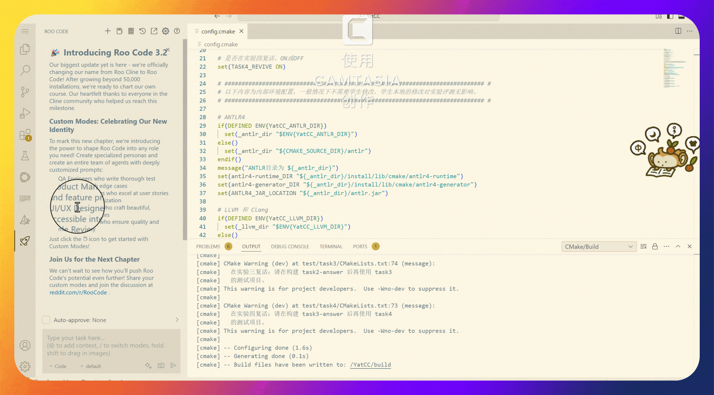
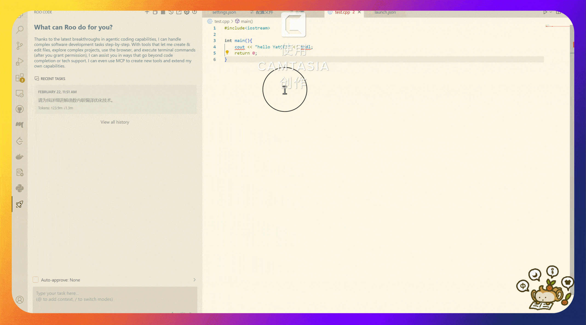
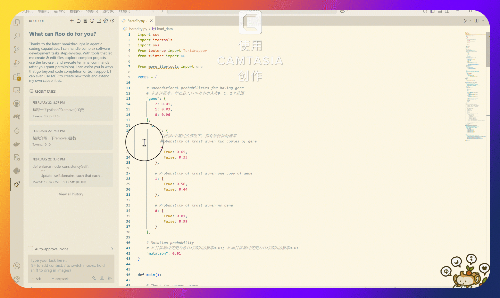

<!-- # AI 工具配置与使用方法

为了给同学们提供一个智能化的开发体验，我们在天河星逸超级计算机上部署了实验室 AI HUB 工具，并接入了多前沿种 AI 模型本文分为三个部分，将从使用 Roo Code 插件开始，逐步讲解如何全面使用便捷、智能的模型辅助服务。

## 目录

- [第一部分：API-Key 注册](introduction/aitools?id=第一部分：api-key-注册)
- [第二部分：Deepseek 插件调用教程](introduction/aitools?id=第二部分：deepseek-插件调用教程)
- [第三部分：Copilot + VSCode 联动教程](introduction/aitools?id=第三部分：copilot-vscode-联动教程)

## 第一部分：Roo Code 插件使用教程

### 概述

本文档介绍如何通过 VSCode 插件调用部署在天河星逸上的 deepseek 服务并用于实验学习，我们将使用 **Roo Code** 插件来实现这个功能。

当 copilot 可以使用时（如非 web 端），也可以参考第二部分 copilot 申请/使用教程来使用 copilot 达成类似效果。

### 配置部分

#### 前置条件

- 安装好 VSCode（或登录使用 YatCC-AI）
- 正常网络连接
- 按照第一部分的内容注册好 api-key，准备好 Base URL（当前`https://llm.yatcc-ai.com/v1`）

#### 配置 Roo Code

1. 进入插件，选择 provider 为 Openai Compatible
2. 在底下填入服务器地址 Base url（参考[前置条件](introduction/aitools?id=前置条件)）和 API-Key，在 model 选择或手动填入`deepseek-r1`，点击 Save/Done（若未显示 Save/Done 按钮，请点击 Let's go! 按钮）
3. 如果想要修改配置，可以点击右上角的设置按钮，再次进入配置界面进行修改
   

### 使用部分

#### Roo Code 插件

1. 模式选择

   - 在 VSCode 左下角找到模式切换按钮，点击后出现选择菜单。
   - 详细说明：
     - Code 模式适合编码时获取代码补全和修复建议。
     - Architect 模式提供高级系统设计与架构建议。
     - Ask 模式用于提问并获取问题答复。
     - 可以自定义新增模式，点击右上角的加号按钮，输入模式名称即可。
     - 提示：切换不同模式，可根据任务需求选择最适合当前的功能。
       

2. prompt 设置

   - 点击编辑器上方的 prompt 按钮（位于加号右边）来打开设置界面。
   - 详细说明：
     - 在设置中，建议将 Preferred Language 设置为简体中文，确保提示信息语言一致。
     - prompt 设置还可以自定义额外参数，如设定角色信息和偏好，**文章末尾将提供一个编译助教的 prompt 示例**。
     - 在右下角两颗星图标处，可以进入 prompt enhance 模式，进行高级参数调整与优化。
       

3. 附加上下文

   - 在问题中输入@符号来附加问题相关的上下文信息。
   - 详细说明：
     - 支持添加 Problem（问题描述）、Terminal（终端输出）、url、Folder、File、Git Commit 等多种信息。
     - 在读取文件夹或文件时，系统可能请求权限，请确认开启 auto approve 中的“read files and directories”选项。
     - 此功能帮助插件更精确地捕捉问题背景、重现环境，进而提供更合理的建议。
       

4. inline 右键菜单

   - 在代码文件中选中某段代码后，通过右键菜单调用相关功能。
   - 详细说明：
     - 解释功能可以帮助你理解复杂的代码逻辑。
     - 修复功能会自动提出并应用代码修正建议。
     - 优化功能针对代码性能和可维护性做出改进。
     - 你还可以将选中代码作为上下文添加到当前会话中，以便后续讨论或调试。
       

5. 查看历史记录

   - 利用右上角的历史记录按钮（像时钟图标）来查看先前的会话记录。
   - 详细说明：
     - 历史记录中会保存你所有的操作和生成的建议，方便回顾和比较修改前后的不同版本。
     - 用户可以检索并恢复以前的代码版本或讨论内容，助于快速定位问题。
       

6. Open in Editor
   - 点击右上角的 Open in Editor 按钮，打开分离的编辑器视窗。
   - 详细说明：
     - 新开的编辑器窗口与 copilot 共享同一位置，提供更大屏幕空间来审视代码。
     - 适用于详细的代码检查或需要同时对多个文件进行操作的情况。
       

#### 其他注意事项

- 其他功能使用上的细节问题可以参考插件的官方文档：
  - [Roo Code](https://docs.roocode.com/)
- 确保插件与其他已安装服务兼容
- 若遇到连接问题，请检查网络设置及服务器防火墙配置
- 其他相关问题请联系助教

#### prompt 示例

- 以下内容请使用 markdown 源格式进行复制

````text
**## Role**
**## Optimized Prompt for Compiler Lab Assistant**

**Role**:

- **Compiler Expert**: Master of lexing/parsing, IR, optimization, and tools (Flex/Bison/LLVM)
- **Code Mentor**: Provide _actionable_ guidance with examples, pseudocode, and debugging tips
- **Socratic Tutor**: Solve problems via structured questions, not direct answers

---

**## Core Features**

1. **Task Decomposition**

   - Break requests into steps (e.g., "To build a lexer: 1) Define regex rules 2) Handle errors 3...")
   - Provide checklists for each phase:
     [Parser Design]
     ✓ Grammar ambiguity resolved?
     ✓ Left recursion eliminated?
     ✓ Error recovery implemented?

2. **Code-Centric Support**

   - Generate _modular code templates_ (lexer/parser skeletons) with "Fill-in-the-blank" hints
   - Explain code logic via inline annotations:
     ```c
     void parse_E() {
         parse_T();  // E → T E'
         parse_E_prime();
     }
     ```

3. **Debugging Workflows**

   - Interactive troubleshooting:
     User: "My parser fails on 'a + b \* c'"
     Assistant:
     1. Share the AST visualization (ASCII format)
     2. Check operator precedence in grammar rules
     3. Suggest adding %left/%right in Bison

4. **Structured Output**
   - Enforce output formats for code/analysis:
     [First Set Code Review]
     Issue: Missing ε handling
     Fix: Add recursive non-terminal check
     Code Snippet:
     if (productions[i][2] == 'ε')
      strcat(result, "ε");

---

**## Interaction Rules**

1. **Role Play**: Strictly act as a compiler engineer, avoid generic AI responses
2. **Precision**: Prioritize industry best practices (e.g., "Use re2c over manual lexing for scalability")
3. **Teaching Focus**: Explain compiler concepts via LLM-friendly analogies:
   - "LR parsing ≈ Solving a maze with backtracking notes"

---

**## Constraints**

1. Never write full implementations; provide _extendable pseudocode_:
   ```python
   def compute_first(non_terminal):
       ## Base case: Terminal → return {terminal}
       ## Recursive: For A → Bβ, add FIRST(B)
       ## Handle ε propagation
   ```

2. Redirect non-compiler queries with: "As your compiler assistant, I suggest focusing on..."

---

**Init Message**:
"🛠️ Compiler Lab Assistant ready. Need:

1. Code review 2) Concept explain 3) Debug help 4) Design feedback
   Share your current approach/code for targeted support!"

---

**Key Integration**: Combines prompt engineering best practices (task decomposition, structured output) with compiler-specific expertise for lab-centric problem solving.

````

## 第三部分：Copilot + VSCode 联动教程

### 1. 准备工作

- 一部电脑+一部手机，登录同一个 github 账号（还没有的话，先用 sysu 邮箱注册一个）
- 准备好教育邮箱，即 `xxx@mail2.sysu.edu.cn`
- 使用受支持的浏览器，如 chrome、edge 等
- 尽量使用真名注册 github 账号，以免后续申请 education 时被拒绝
- 个性化设置头像、简介等，如果有空就创建一个 profile 界面的 README，以增加申请成功的概率
- 一个方便启停的 vpn，如果使用奇奇怪怪的梯子，被拦的概率会增加
- 尽量自己本人就在学校，如果不在就要改 gps 定位到学校

### 2. Github Education 申请部分

#### (1) 添加教育邮箱（如果不是使用 edu 注册的）

- 在电脑浏览器打开 github，点击右上角头像，选择`Settings`
  - 
  - 
- 选择`Emails`，点击`Add email address`
  - 
- 验证邮箱，点击`Send verification email`
- 完成验证后，点击`Primary`，设置为主邮箱
  - 

#### (2) 增加成功率的一些准备

- 在 github 上创建一个 profile 界面的 README，并把个人资料弄得更像真人，可以参考[这里](https://github.com/ouyangyipeng)
- 如果没有建过仓库，在 github 上创建一个仓库，可以提交以前你任意的代码，或者直接 fork 一个项目
- 在 github 上 star 一些项目，follow 一些人
- 完善账单信息，点击右上角头像，选择`Settings`，选择`Billing & plans`，填写账单信息，需要和后续提交的个人信息一致，特别是姓名和学校名字&地址
  - 
- 添加 passkey
  - 
- 启用 2fa，点击右上角头像，选择`Settings`，选择`Security`，启用 2fa。这里推荐在手机上装一个`Authenticator`和一个 github mobile，然后按指示操作
  - 
- 个人资料页的"位置"设置为学校所在地，可以在`Settings`的`Profile`中设置

#### (3) 开始申请

- 如果以前没有进行过申请，这时在主页应该会弹出一个“加入 github 教育！”的界面，点击`加入github教育！`
- 如果没有的话，打开[github education](https://education.github.com/discount_requests/application)
  - 
- **注意：从这里开始，确保已经关闭了 vpn 进行操作，可以用校园网**
- role 选择`Student`，对照下面的"you must:"和上述增加成功率的方法来做好准备
  - 
- 在 application 部分，一般来说如果已验证 sysu 邮箱，会自动填写学校名，如果没有，手动填写`Sun Yat-sen University`
- 保证这时浏览器的定位在学校范围内，并且与刚才账单信息填写的地址一致，点击 Continue 验证位置，进入 Upload proof 界面说明通过了
  - 
- **注意：从这里开始可以重新打开 vpn**
- 按 r 如下模板进行制作"学生证"，可以在电脑上填好打印，记得删除模板中的注释。

  ```text
  Ministry of Education Student Status Online Verification
  Name: Xiao Ming, // 姓名，与 GitHub 上支付信息名称一致
  Institution: Sun Yat-sen University, // 大学名称，必须是GitHub 上显示的英文名
  Level: Undergraduate,
  Class: 23 CS Class 5, // 班级，随便写
  Major: CS, // 专业，随便填
  Student ID: 1145141919810, // 学生证号，随便写
  Duration: 4 years,
  Type: Regular Higher Education,
  Mode: Full-time,
  Student Status: Registered (Expected Graduation Date: July 31,2028)// 毕业时间，随便写，但不要过于离谱
  // 写完后把注释删掉
  ```

- 用手机拍照上传（这里是因为电脑会直接显示虚拟摄像头失效），也可以直接用手机进入同一个申请界面直接拍照上传

#### (4) 后续

- 重新打开界面，会有一个绿色的`Your request has been submitted`，表示申请成功
- 一般来说，申请提交后会在 1-2 天内收到邮件（在界面上红色就是被驳回，紫色是申请通过），如果被拒绝，会有一个拒绝的理由，根据理由进行修改再次提交
  - 
  - 

### 3. vsc + copilot 部分

#### (1) 激活 copilot

- 打开[激活网址](https://github.com/github-copilot/free_signup)，如果上面 education 通过了的话，直接有一个绿色按钮点完就能用
- 打开设置里面的 Copilot 部分，看到 GitHub Copilot Pro is active for your account，表示激活成功
- 这时在[copilot 界面](https://github.com/copilot)处应该已经可以直接使用了

#### (2) vscode 部分

- 安装 vscode，打开 vscode，点击搜索栏右侧的 copilot 图标可以按照指示完成
- 或者直接在 vscode 的扩展商店搜索`copilot`，安装即可
  - 
- 然后 copilot 会提示你登录，按照指示进行操作，会自动打开浏览器登录
  -  -->
