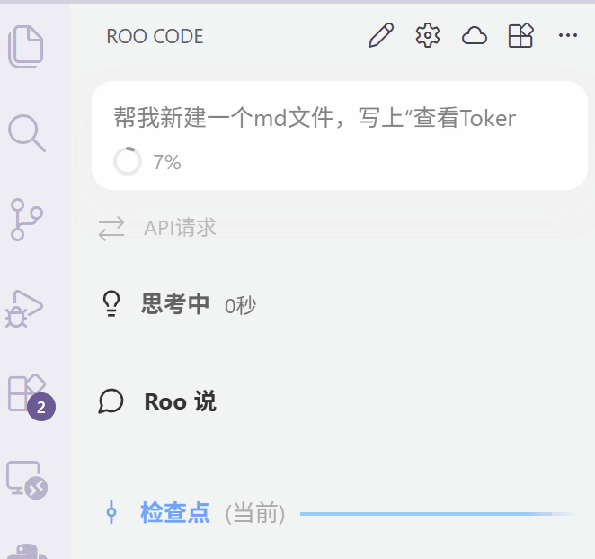

# 最终测评方式说明

> 文档更新时间：2026.03.03 23:27

由于 **YatCC** 平台更新迭代中，今年的编译器构造实验不提供在线测评系统。

目前的提交与测评方式暂定如下：

1. 使用实验框架内置的 pack 功能打包实验文件并提交至[超算习堂](https://easyhpc.net/course/253)，由助教侧进行最终测评；
   
2. 最终测评会存在隐藏测例，但是隐藏测例不会超出实验所定义的语法范围，且允许在截止日期前重复提交，取最高分；
  
3. 最终测评分数会在每周末更新在超算习堂，因此鼓励同学们提早完成实验。

实验报告规则：

1. 打包实验文件后，将 PDF 格式的实验报告放入到压缩包中；

2. 附带的会话记录文件，一并放在压缩包中的实验报告同级路径；
  
3. 其余要求以实验报告模板为准。

Token 用量查看：

将鼠标悬停在气泡左下角上的圆环即可。

