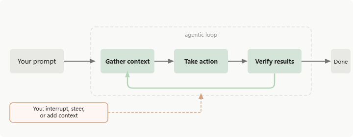
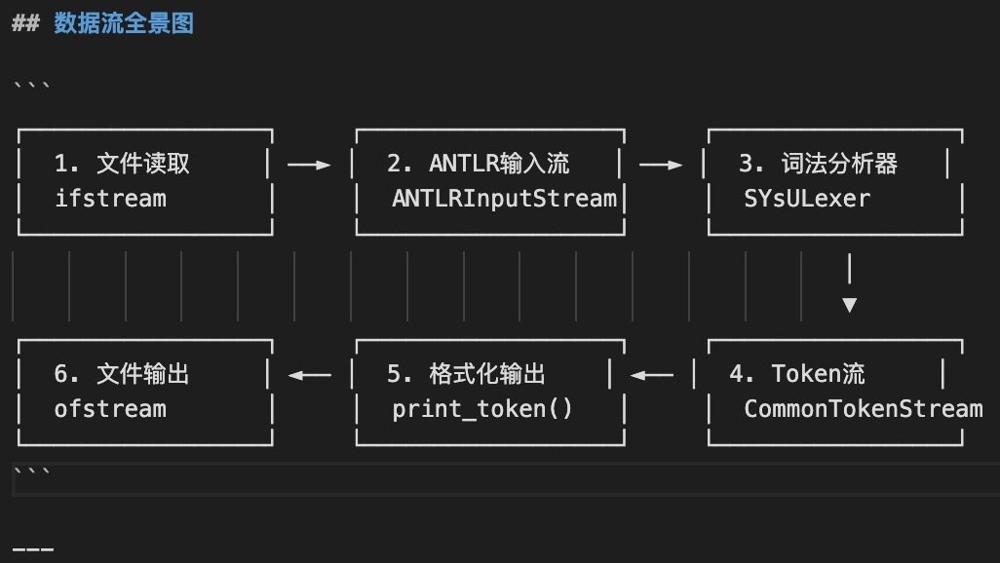
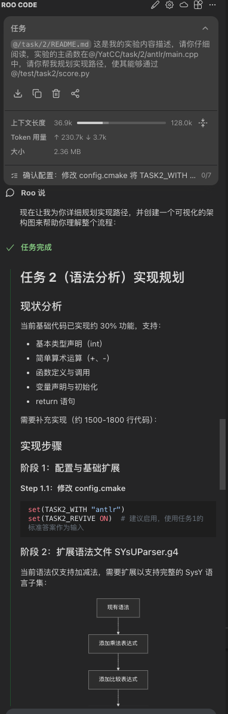
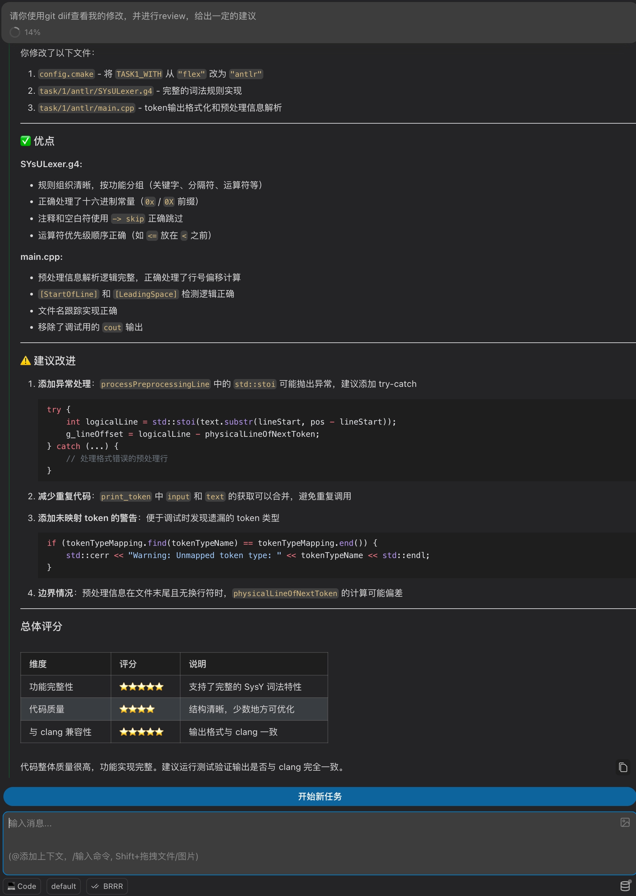
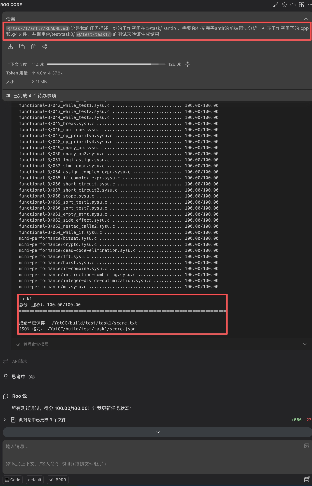
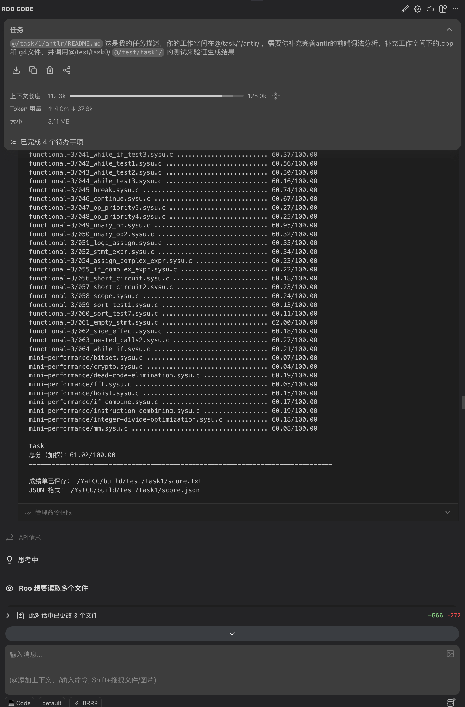
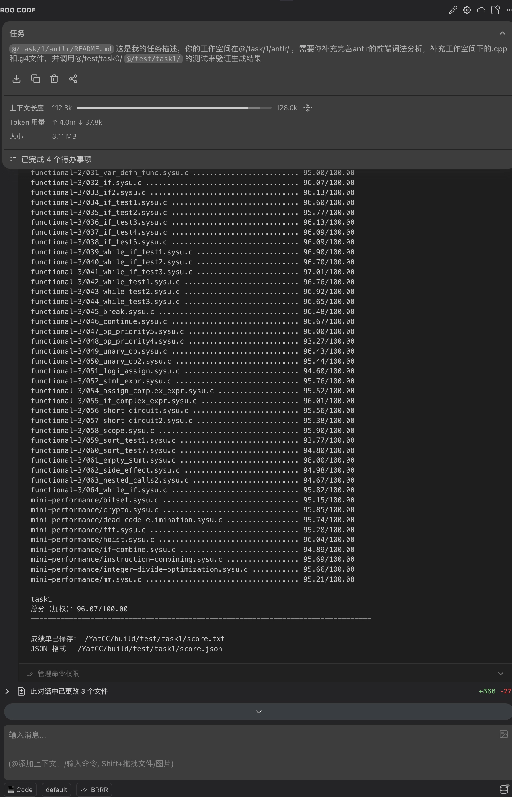
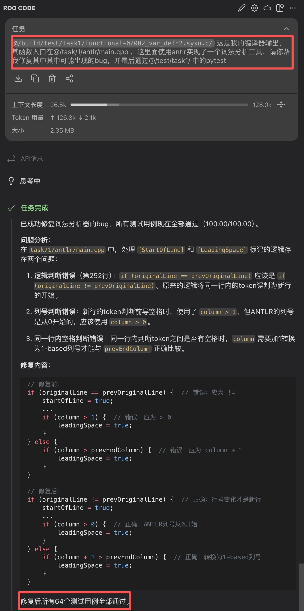
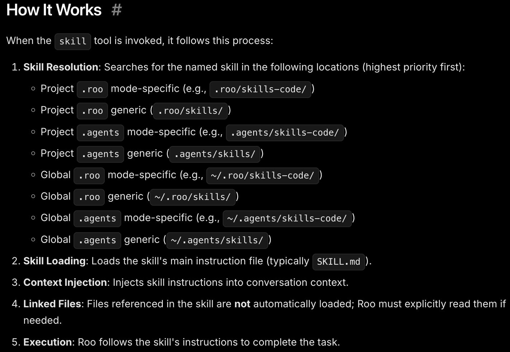
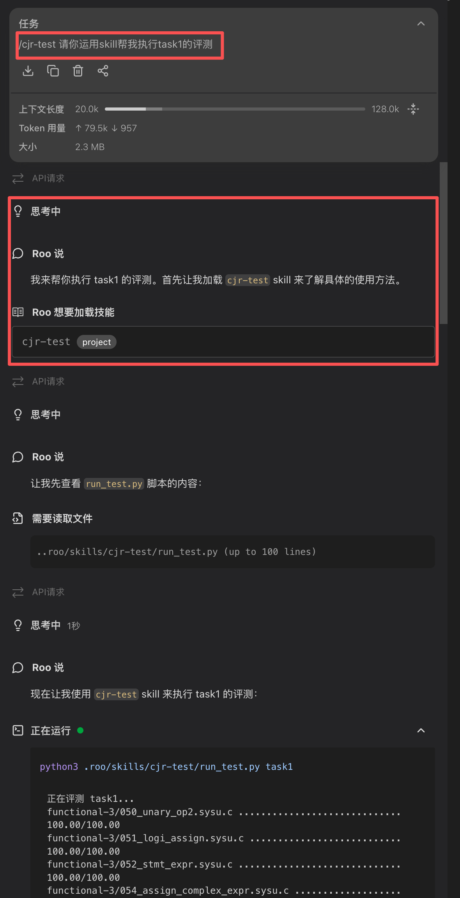

# Vibe Coding

## 背景

### 什么是Vibe Coding

Vibe coding 指的是开发者使用自然语言提示让LLM直接生成可执行的代码、并以结果驱动而非逐行手写。相信同学们或多或少有听说一些Vibe Coding的产品，从早期的 **GitHub Copilot**，到更加集成化的开发环境 **Cursor**，以及命令行交互的Codex Cli、Claude Code Cli等。尤其在过去一年，随着模型能力和agent应用的发展，Vibe Coding的生成代码的质量直线上升，大大提升了生产的效率，降低了学习的门槛。在当下，使用Vibe Coding提高学习效率已然成为一个必备的技能。

### Agent loop

为了方便大家理解如何使用Vibe Coding，我们可以从原理出发，即当你发起一个任务时，agent是如何执行的。

上图是一个简单的agent loop，其中包含三个stage，Gather Context，Take Action，Verify Results。三个stage循环反复，在整个过程中，LLM会分析需要哪些工具，并调用（如读写文件，执行代码等），将返回的信息append到context中作为输入继续生成。同时你也可以打断循环，添加新的context作为补充。

所以一个完整的工作流程是，提供一个prompt：帮我写一个Hello World的C语言程序。然后LLM会判断是否需要额外的上下文信息，如果需要则需要调用工具（在这个例子里不需要）；将context传递给LLM，并调用工具创建一个.c文件将生成的代码写入其中；最后通过语法检查或者执行验证生成的正确性，将验证结果加入context供LLM判断，成功则结束任务。

## Vibe Coding 可以做些什么

Vibe Coding可以辅助我们**读**和**写**代码，其中读代码的能力常被低估。从简单的 API 说明到跨文件的数据流追踪，模型通常能给出有用且可操作的解释，显著压缩上手与熟悉代码框架的时间。与此同时，LLM 能协助任务拆解、生成实现方案、做 code review，并能在合适的流程和约束下直接生成可运行代码。

### 读

#### 理解代码

LLM 在训练时吞入大量代码语料，是非常好的静态分析工具。从最简单的API解释或查询，到整个程序的数据流，LLM基本都可以给出正确的解答，大大降低了学习代码框架时间。

上图是一个简单的example，通过提供main函数，让其直接输出数据流图，可以让我们快速了解文件之间的关联。

#### 规划方案

同时，LLM由于见过大量的代码，他能够很好的辅助你修缮实现路线。你可以将实验任务描述给他，讲解一个初步的实现路线，他会帮你完善其中的细节，最后返还一个完整的plan给你，可以帮助你理解实验任务，或是可以直接提交给他自己来完成。

#### Code Review

在做出修改后（需要使用git进行版本管理），可以让LLM帮你进行code review，他可以从各个角度帮你完善代码，从正确性，到格式，都可以给出较为详细的建议。同时你也可以让他帮你生成规范的commit message，并commit。

上图是一个简单的示例，我让kimi对我实验1的代码进行了CodeReview，他会给出代码功能、代码规范性、和修改的建议，可以帮助提高代码的规范性。

### 写

代码生成是LLM最直接的用途：你可以用自然语言描述函数、输入输出以及边界条件，模型会生成对应的代码返还给你。同时你也可以在出现bug时，将程序和log信息提供给LLM让其帮忙debug。

## 如何写好prompt

写prompt是和大模型交互的重要方式，之前思维链的出现从侧面印证了写好prompt能够直接提升LLM的回答质量。那在代码生成这个部分，我们该如何写prompt，让模型能够理解我们的意图呢。

首先，需要有一个mindset，把LLM想象成一个只有短期记忆（这里指模型的context）的人；想想在小组合作时，是如何和同学进行分工合作的，和LLM的交互也理应如此。

1. 在这个mindset下，你应该要提供给他更为详细的信息，而不是直接甩给它一个空洞的任务概要。以代码生成任务为例，一个良好的promt应该包含几个要素：
- 有足够的上下文信息，在哪个文件中修改，有哪些相关文件
- 较为清晰的任务描述，如输入输出格式或需要实现的算法
- 检验的标准，如单元测试（yatcc中集成的单元测试）

对于第一点，让我们回忆一下前面的agent loop，如果agent认为当前的上下文不够，他就会调用工具收集更多的上下文信息，这时候就会有很多无用的信息进入context，容易让agent抓不到重点，导致最后的生成质量下降，同时这样也会导致烧的token数目增多，增大使用的开销。

对于第二点，如果没有较为清晰的任务描述，agent也并不知道你的意图（它也没有强到会读心术），有些agent会进入plan mode让你补充清楚，有些可能就直接随机生成一版，这时代码的行为就不一定会符合你的预期，导致返工。

对于第三点，同样也是回忆一下agent loop，agent如果再进行完一轮生成后会进入verify阶段，如果不提供单元测试，通常来说它只会简单校验其中的逻辑和它从context理解的是否有偏差，以及语法检查。这往往是不够的。而如果你提供了一个单元测试，他就会调用单元测试，直到通过单元测试，进入自动化开发的流程。而这个单元测试是经过你验证的，这样就能保障代码的质量。

同时如果你想要它帮你debug，也需要提供额外的信息。因为agent是没有办法模拟程序运行的，他只能获取程序的静态信息，log，或者运行一遍代码。所以在这个场景下，你需要提供一个最小化demo供它去复现bug，或者至少提供信息详尽的log给它分析。如果提供了最小化demo供其复现，agent loop就会自动的进行verify操作，不断迭代，直到在最小化demo中通过或是达到context上限。

### 一些实际的example

使用Kimi k2.5完成task1

上图是一个简单的例子，使用一个prompt就从0完成了task1的antlr部分。让我们细品一下这个prompt提供了哪些信息给LLM。首先，将目录下的实验描述文档加入context让LLM能够理解这个任务的要求，然后明确了上下文范围（提供了工作目录）和需要修改的文件，最后制定了校验的标准（test的pytest文件）。实际上，这个结果不是一次性生成通过的，从61→96→100，全部依靠agent自己迭代，这是因为我们提供了非常明确的信息，让其能够在agent loop中使用明确的校验标准进行verify，最终输出到我们目的的代码（当然当任务复杂时，上下文长度可能会满，单次生成也没有办法完成，这时就需要提前做好任务切分）。

### 使用vibe coding Debug

下面是一个使用vibe coding debug的简单示范。首先提供了程序输出的log供其分析，同时对于上下文有一个简单的描述帮助agent进行理解，然后提供标准化的校验流程供agent进行校验。最后也是成功解决了bug，获得了满分。

## Skills

Skil是一个扩展模型能力的可配置、的共享工具箱。在Roo code中，模型记忆的生命周期通常与当前的对话框相同。如果说你需要频繁的使用相同的工作流程处理多个不同的任务，同一个context是绝对装不下的，而且会存在很多当前任务的临时信息留存在context。Skills这个特性就可以很好的解决这个问题。

Skills本是其实不是一个很复杂的东西，本质上是一个prompt工程，通过markdown的形式将抽象好的工作流prompt保存在一个特定的位置，对于实验内置的roo code而言，skill的相关文档会被保存在下图的文件夹中。

一个skil通常包含几个部分，首先是yaml格式的简易注释，包含了description（当你的输入让LLM认为符合skill描述时，会自动触发），关于skil可能用到信息的markdown信息，以及抽象好的脚本供agent进行调用。听完你是否觉得很复杂，实则也不是什么高大上的东西，上述所有内容，都是可以用自然语言口述，让agent自己写好，使用时再让他自己调用。下图就是一个简单的例子：

我们封装了一个简单的调用单元测试的skill，使用prompt提供了足够的信息，剩下的都是agent自己生成的，然后你可以人工对里面的信息进行微调，这里就不过多赘述了。

skill使用起来也非常的简单，你只需要显示的指定skill的名字，让roo code去加载即可，如上图所示，其成功的运行了一个单元测试。

上述只是一个非常简单的example，想用好skills也没有那么简单，感兴趣的同学可以去研究下anthropics下专门存放claude skill的仓库（[https://github.com/anthropics/skills](https://github.com/anthropics/skills)），里面有一个skill-creator的skill，可以通过它来创建新的skill。同时也可以学习下skill该如何去写，这些都需要同学们自己去探索。

## 推荐阅读
- Skills相关的实践
  - https://github.com/anthropics/skills
- Claude 官方文档
  - https://code.claude.com/docs
- Roo Code官方文档
  - https://docs.roocode.com/