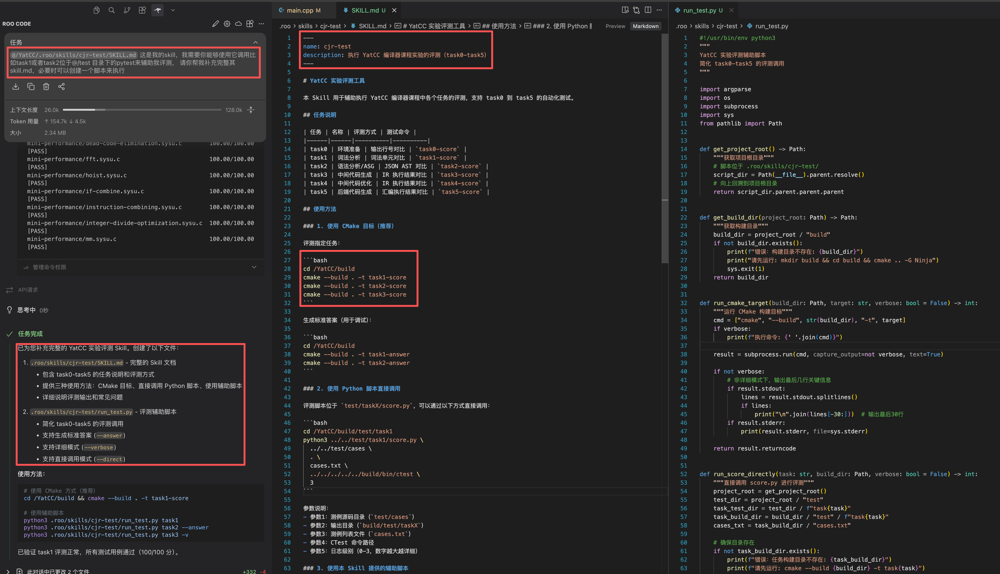

# Vibe Coding

## 背景

### 什么是 Vibe Coding

Vibe Coding 指的是开发者使用自然语言提示让 LLM 直接生成可执行的代码，以结果驱动而非逐行手写。相信同学们或多或少听说过一些 Vibe Coding 的产品，从早期的 **GitHub Copilot**，到更加集成化的开发环境 **Cursor**，以及命令行交互的 Codex CLI、Claude Code CLI 等。尤其在过去一年，随着模型能力和 Agent 应用的发展，Vibe Coding 生成代码的质量直线上升，大大提升了生产效率，降低了学习门槛。在当下，善用 Vibe Coding 提高学习效率已然成为一项必备技能。

### Agent Loop

为了方便大家理解如何使用 Vibe Coding，我们可以从原理出发，即当你发起一个任务时，Agent 是如何执行的。

上图是一个简化的 Agent Loop，其中包含三个阶段：**Gather Context（收集上下文）**、**Take Action（执行操作）**、**Verify Results（验证结果）**。三个阶段循环往复，在整个过程中，LLM 会分析需要哪些工具并进行调用（如读写文件、执行代码等），将返回的信息追加到上下文中作为输入继续生成。同时你也可以打断循环，添加新的上下文信息作为补充。

以一个完整的工作流程为例：提供一个 prompt——"帮我写一个 Hello World 的 C 语言程序"。LLM 会先判断是否需要额外的上下文信息，如果需要则调用工具获取（在这个例子里不需要）；然后将上下文传递给 LLM，调用工具创建一个 `.c` 文件并将生成的代码写入其中；最后通过语法检查或执行来验证生成结果的正确性，将验证结果加入上下文供 LLM 判断，成功则结束任务。

## Vibe Coding 可以做些什么

Vibe Coding 可以辅助我们**读**和**写**代码，其中读代码的能力常被低估。从简单的 API 说明到跨文件的数据流追踪，模型通常能给出有用且可操作的解释，显著缩短上手和熟悉代码框架的时间。与此同时，LLM 能协助任务拆解、生成实现方案、进行 Code Review，并能在合适的流程和约束下直接生成可运行代码。

### 读

#### 理解代码

LLM 在训练时吞入了大量代码语料，是非常优秀的静态分析工具。从最简单的 API 解释或查询，到整个程序的数据流分析，LLM 基本都可以给出正确的解答，大大缩短了学习代码框架的时间。

上图是一个简单的示例：通过提供 main 函数，让 LLM 直接输出数据流图，帮助我们快速了解文件之间的关联。

#### 规划方案

由于 LLM 见过大量代码，它能够很好地辅助你完善实现路线。你可以将实验任务描述给它，并提供一个初步的实现思路，它会帮你补充其中的细节，最终返回一个完整的方案。这既可以帮助你理解实验任务，也可以直接交给它来实现。

#### Code Review

在做出修改后（建议使用 git 进行版本管理），可以让 LLM 帮你进行 Code Review。它可以从多个角度帮你完善代码，包括正确性、代码风格等，并给出较为详细的修改建议。同时你也可以让它帮你生成规范的 commit message 并完成提交。

上图是一个简单的示例：让 Kimi 对实验1的代码进行了 Code Review，它会给出代码功能分析、代码规范性评价以及修改建议，有助于提高代码质量。

### 写

#### 代码生成

代码生成是 LLM 最直接的用途：你可以用自然语言描述函数的功能、输入输出以及边界条件，模型会生成对应的代码。对于较为复杂的任务，建议先将其拆分为多个小任务，逐步生成并验证，而不是试图一次性完成所有功能。

#### 辅助调试

当程序出现 bug 时，你可以将相关代码和日志信息提供给 LLM，让它帮忙定位和修复问题。为了获得更好的调试效果，建议提供一个**最小化的复现用例**，或者至少提供信息详尽的日志输出。这样 Agent 可以在 Loop 中自动复现、修复、验证，不断迭代直到问题解决。

## 如何写好 Prompt

编写 prompt 是与大模型交互的核心方式。思维链（Chain of Thought）的出现从侧面印证了良好的 prompt 能够直接提升 LLM 的回答质量。那么在代码生成场景下，我们该如何编写 prompt，让模型准确理解我们的意图呢？

首先，需要建立一个思维模式：把 LLM 想象成一个只有短期记忆（即模型的上下文窗口）的协作者。回想一下在小组合作时，你是如何和同学进行分工协作的——与 LLM 的交互也应如此。

在这个思维模式下，你需要提供尽可能详细的信息，而不是直接给出一个笼统的任务概要。以代码生成任务为例，一个良好的 prompt 应该包含以下要素：
- **充足的上下文信息**：在哪个文件中修改，有哪些相关文件
- **清晰的任务描述**：如输入输出格式、需要实现的算法等
- **明确的验证标准**：如单元测试（YatCC 中集成的单元测试）

对于第一点，回忆一下前面的 Agent Loop：如果 Agent 认为当前的上下文不足，它就会调用工具收集更多信息。这时容易引入大量无关信息，导致 Agent 难以抓住重点，最终影响生成质量；同时也会消耗更多 token，增加使用成本。

对于第二点，如果缺少清晰的任务描述，Agent 无法准确理解你的意图。部分 Agent 会进入规划模式请你补充信息，但也有些可能直接生成一个不确定的版本，其行为未必符合你的预期，导致返工。

对于第三点，同样回忆一下 Agent Loop：Agent 在完成一轮生成后会进入验证阶段。如果不提供单元测试，它通常只会做简单的逻辑校验和语法检查，这往往是不够的。而如果你提供了单元测试，它就会反复运行测试、修复问题，直到通过所有测试用例，形成自动化的开发闭环。由于这些单元测试是经过你验证的，因此能有效保障代码质量。

此外，如果你需要 LLM 帮你调试，同样需要提供充足的信息。Agent 无法模拟程序运行，它只能获取程序的静态信息、日志或实际运行结果。因此在调试场景下，你需要提供一个最小化的复现用例，或者至少提供信息详尽的日志供其分析。如果提供了可复现的用例，Agent Loop 就会自动进行验证和迭代，直到问题解决或达到上下文长度上限。

### 一些实际的示例

上图是一个简单的例子：使用一个 prompt 就从零完成了 task1 的 ANTLR 部分。我们来分析一下这个 prompt 提供了哪些信息。首先，将目录下的实验描述文档加入上下文，让 LLM 理解任务要求；然后明确了上下文范围（提供了工作目录）和需要修改的文件；最后指定了验证标准（测试用的 pytest 文件）。实际上，这个结果并非一次生成就通过的，分数从 61 → 96 → 100，全部依靠 Agent 自己迭代完成。这正是因为我们提供了足够明确的信息，使其能在 Agent Loop 中使用清晰的验证标准进行校验，最终输出符合预期的代码（当然，当任务较为复杂时，上下文长度可能不够用，单次生成也无法完成，这时就需要提前做好任务拆分）。

### 使用 Vibe Coding 调试

下面是一个使用 Vibe Coding 进行调试的简单示范。首先提供了程序输出的日志供 Agent 分析，同时对上下文做了简要描述以帮助 Agent 理解问题背景，然后提供了标准化的验证流程供 Agent 校验。最终成功解决了 bug，获得了满分。

## Skills

Skill 是一个可配置、可共享的扩展模型能力的工具箱。在 Roo Code 中，模型记忆的生命周期通常与当前对话窗口相同。如果你需要频繁使用相同的工作流处理多个不同的任务，单个上下文窗口显然不够用，而且会有大量当前任务的临时信息残留。Skill 这个特性可以很好地解决这个问题。

Skill 本身并不复杂，本质上是一种 prompt 工程：通过 Markdown 的形式将抽象好的工作流 prompt 保存在特定位置。以实验内置的 Roo Code 为例，Skill 的相关文档会被保存在下图所示的文件夹中。

一个 Skill 通常包含几个部分：首先是 YAML 格式的元信息注释，包含 description（当你的输入匹配 Skill 描述时会自动触发）；然后是 Skill 可能用到的相关信息（Markdown 格式）；最后是抽象好的脚本供 Agent 调用。这看起来似乎比较复杂，但实际上并没有那么难——上述所有内容都可以用自然语言描述，让 Agent 自动生成，使用时再让它自行调用即可。下图就是一个简单的例子：

我们封装了一个简单的调用单元测试的 Skill：通过 prompt 提供了足够的信息，其余部分由 Agent 自动生成。之后你可以根据需要对其中的内容进行微调，这里不再赘述。

Skill 使用起来也非常简单，只需要显式地指定 Skill 的名称，让 Roo Code 加载即可。如上图所示，它成功运行了一个单元测试。

上述只是一个非常简单的示例。想要用好 Skill 也并非易事，感兴趣的同学可以参考 Anthropic 专门存放 Claude Skill 的仓库（[https://github.com/anthropics/skills](https://github.com/anthropics/skills)），其中有一个 skill-creator 的 Skill，可以通过它来创建新的 Skill。同时也可以学习 Skill 的编写方式，这些都值得同学们自行探索。

## 推荐阅读
- Skills 相关的实践
  - https://github.com/anthropics/skills
- Claude 官方文档
  - https://code.claude.com/docs
- Roo Code 官方文档
  - https://docs.roocode.com/
