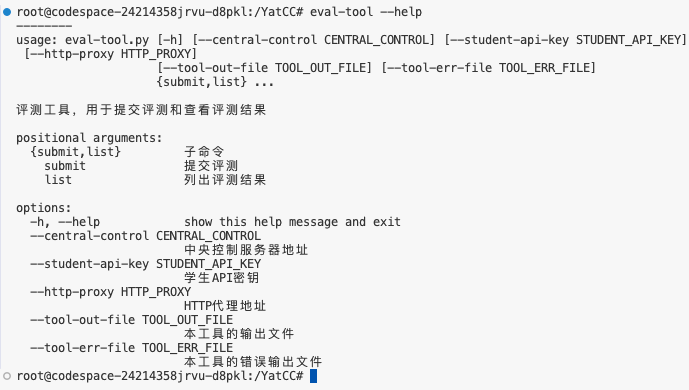
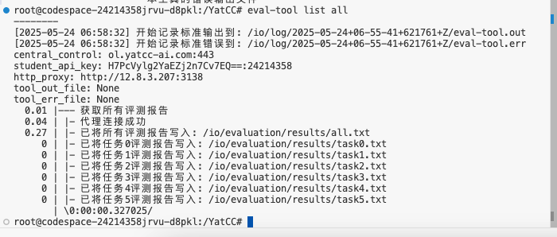
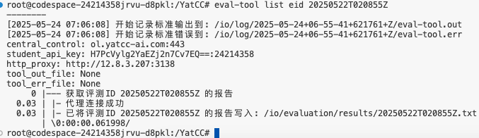
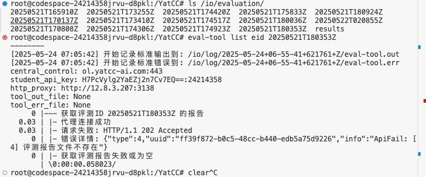
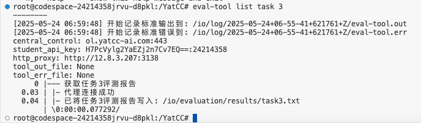
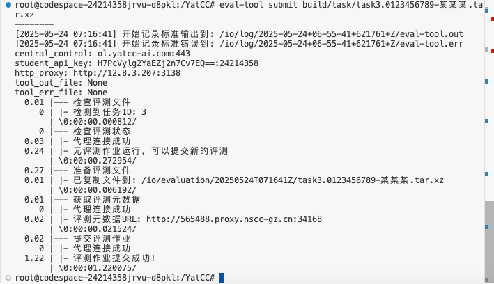
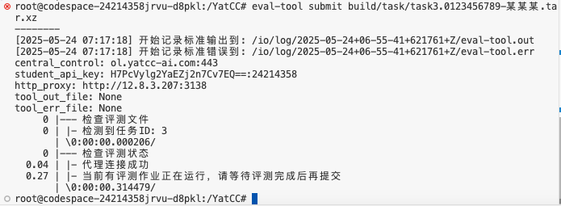
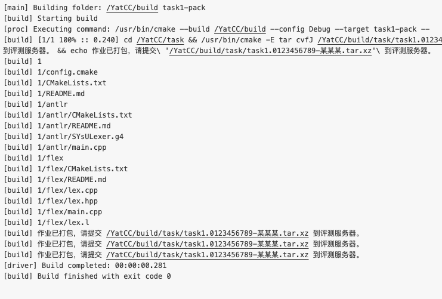
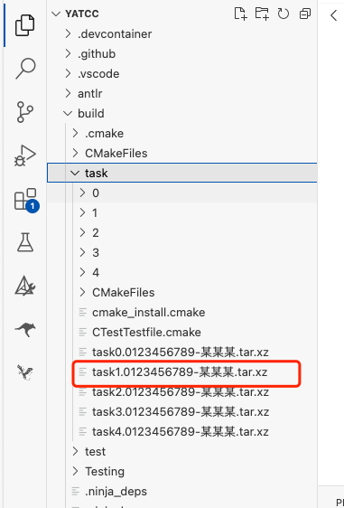
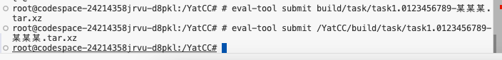

# 在线测评系统使用方法

> 文档更新时间：2025.05.24 14:32

**YatCC** 的在线评测系统基于**YaCC-AJ**构建。**YaCC-AJ** 是一款为项目型大作业设计的智能评分系统，目前已经集成到我们的**YatCC**框架内。

## 一些你所必须知道的事实

1. 目前**YatCC-AJ**处于开发迭代阶段，相应的web前端并没有完善，因此使用命令行的提交方式。

2. **YatCC-AJ**依赖于[在线平台](https://ol.yatcc-ai.com/static/index.html#/)的使用，因此使用本地开发的同学需要跟随教程多做几步，希望可以得到各位的**谅解和支持**！

3. 本地评测过程中，可能会出现一些core.xxx的文件，此时请你**切换CMake编译器**配置为GCC，把core.xxx文件删除后，重新测评看能否解决。

4. 在提交测评到**YatCC-AJ**前，检查你是否有
    
    4.1. 在本地成功执行评测

    4.2. 按照实验文档提示进行了打包，压缩包文件名称与本人信息相符，大小不超过**8192KB**（可以检查task/taskid下的目录里是否有core.xxx的文件，有则删掉）

## 面向代码空间开发/本地开发的用户

1. 我们的一些规定

    1.1. `/io/evaluation` 为代码空间的测评结果目录，初始时与远程一致，被用户修改后不保证一致。

    1.2. `/io/evaluation/{eid}` 为每次提交作业的临时目录，`eid`为时间戳，不必关心生成逻辑，只需要知道他是`eid`即可。

2. 由于目前web前端未就绪，助教为大家准备了命令行工具，需要麻烦大家手动键入命令行操作。

3. 命令行工具已经嵌入到大家的**代码空间**（而不是本地开发！），因此目前所有的评测操作都需要在**代码空间**操作！

4. 命令行工具可以显示我们**远端测评数据**，代码空间的数据可被手动修改且无同步措施，因此请**不要修改**`/io/evaluation`下的目录，后果自负！

5. 命令行工具介绍：

    5.1. 命令行工具：`eval-tool`

    下图显示了所有指令，一般的参数我们**并不需要关心填入**，工具会默认读取。

    

    5.2. 列出所有测评：`eval-tool list all`

    列出所有测评后，可以在对应的目录下看到更新后的数据，all更新会顺带更新每一个task的数据。

    

    5.3. 根据`eid`列出某个测评：`eval-tool list eid xxx`

    根据`/io/evaluation`下的子目录，可以得到`eid`，如果你想单独列出某个`eid`对应的成绩，可以使用这个命令。

    

    如果远端测评并没办法正确进行，或者出现一些不可预料的错误，将会出现下图的情况。

    此时请你检查自己的源代码是否更新到了最新，如果确认最新，请联系助教。

    

    5.4. 根据`taskid`列出task所有测评：`eval-tool list task x`

    这个命令可以用于列出某个task的评测结果，具体文件在图中显示的目录中，注意只能列出0～5的task。

    

    5.5. 提交作业：`eval-tool submit xxx`

    这个命令需要接一个**代码空间本地**已有的文件路径（绝对或相对），提交之后可以去对应的`/io/evaluation/{eid}`下查看是否已经有反馈的结果。

    

    目前仅支持最多一个作业评测，因此，当已有作业评测时，继续提交会显示错误，此时请等待测评完成再提交。

    

## 面向代码空间开发的用户

使用代码空间开发的用户可以轻松使用一站式解决方案，只需要使用`taskx-pack`的构建目标，等待构建完成。

构建完成后，可以通过上图指引的压缩包放置的位置，找到对应的压缩包，当然你只需要知道在哪里就好，这是为大家说明使用。

使用`eval-tool`通过绝对/相对路径提交作业即可评测。

## 面向本地开发的用户

本地开发的用户需要**借助代码空间**来提交作业评测。

当你本地进行`taskx-pack`构建之后，打开你的代码空间，将你构建好的压缩包上传到代码空间任意一个位置（标准位置为`/YatCC/build/task/`）。

然后使用`eval-tool`通过绝对/相对路径提交作业即可评测。

