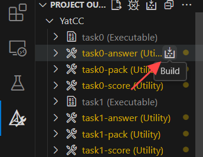
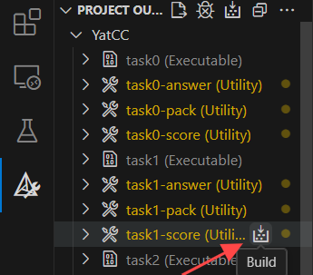
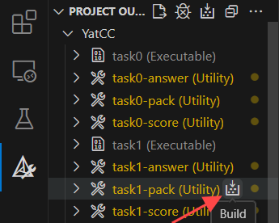

## 任务描述

本次实验中需要实现一个简单的词法分析器，它接收经过预处理的源代码，输出词法分析的结果。

---

`/YatCC/test/cases`路径下存放了本实验所有的测试用源代码文件。以`/YatCC/test/cases/functional-0/000_main.sysu.c`为例，其内容如下所示：

```c++
int main(){
    return 3;
}
```

其经过`clang`预处理后，会得到以下内容：

```c++
# 1 "./functional-0/000_main.sysu.c"
# 1 "<built-in>" 1
# 1 "<built-in>" 3
# 384 "<built-in>" 3
# 1 "<command line>" 1
# 1 "<built-in>" 2
# 1 "./functional-0/000_main.sysu.c" 2
int main(){
    return 3;
}
```

相比源代码，多了一些以`#`开头的行。这些行是`clang`在预处理过程中插入的，称之为**行标记**（Linemarkers）。

行标记的基本格式是`# linenum filename flags`，它的含义是**下一行**来自于`filename`文件的第`linenum`行。例如`# 1 "./functional-0/000_main.sysu.c 2"`表示下一行`int main(){`来自于`./functional-0/000_main.sysu.c`文件的第 1 行。

至于`flags`的含义以及更多行标记的细节可以参考[这里](https://gcc.gnu.org/onlinedocs/cpp/Preprocessor-Output.html)，此处不再赘述。

---

用`clang`进一步对预处理后的源代码进行词法分析，其结果如下：

```c++
int 'int'  [StartOfLine]  Loc=<./functional-0/000_main.sysu.c:1:1>
identifier 'main'  [LeadingSpace]  Loc=<./functional-0/000_main.sysu.c:1:5>
l_paren '('  Loc=<./functional-0/000_main.sysu.c:1:9>
r_paren ')'  Loc=<./functional-0/000_main.sysu.c:1:10>
l_brace '{'  Loc=<./functional-0/000_main.sysu.c:1:11>
return 'return'  [StartOfLine]  [LeadingSpace]  Loc=<./functional-0/000_main.sysu.c:2:5>
numeric_constant '3'  [LeadingSpace]  Loc=<./functional-0/000_main.sysu.c:2:12>
semi ';'  Loc=<./functional-0/000_main.sysu.c:2:13>
r_brace '}'  [StartOfLine]  Loc=<./functional-0/000_main.sysu.c:3:1>
eof ''  Loc=<./functional-0/000_main.sysu.c:3:2>
```

其中每行开头的单词是后面单引号包裹的词法单元的别名, `[StartOfLine]` 表示该词法单元位于所在行的行首，`[LeadingSpace]`表示该词法单元前面存在空格。

`Loc`中的内容则是代表词法单元**在源代码文件中**所处的位置。例如`Loc=<./functional-0/000_main.sysu.c:1:1>`就表示这个词法单元位于`./functional-0/000_main.sysu.c`文件的第 1 行第 1 列（都是从 1 开始计数）。

---

本次实验的目标，就是自己实现一个词法分析器，输入经过预处理的源代码，能够得到和上面一样的结果！

同学们可能会想，实现这样的一个词法分析器的工程量应该很大吧？设计实验以及编写文档的助教和大家的想法是一样的！所以肯定不会让大家从零开始实现一个词法分析器。在`task1`中我们提供了`flex`和`antlr`两种框架来实现我们的词法分析器，其中`antlr`在`task2`中还会继续用到。同学们可以自由选择自己喜欢的框架进行实现。

## 实验步骤

1. 预处理源代码

   在`PROJECT OUTLINE/YatCC/test/task0`中选择构建`task0-answer`。该操作将自动将所有`YatCC/test/cases/*/*.sysu.c`源代码进行预处理。预处理结果将保存在`YatCC/build/test/task0`文件夹中，作为词法分析器的输入。

   

2. 实现词法分析器

   本次实验可以选择使用`flex`或`antlr`实现词法分析器，需要在`/YatCC/config.cmake`中设置`TASK1_WITH`为`"flex"`或`"antlr"`。设置完成后，同学们可以自由编写`YatCC/task/1/flex`或`YatCC/task/1/antlr`中的源代码。

   完成源代码编写后，可以通过`PROJECT OUTLINE/YatCC/test/task1`中选择构建`task1-score`进行实验一的评分。完成所有样例测评后，每个样例的标准输出`answer.txt`、实际输出`output.txt`和评分结果`score.txt`将保存在`YatCC/build/test/task1`文件夹中，同学们可以根据评分结果对比标准输出和实际输出，并进行代码修改。

   

   实验要求能够正确输出除`eof`和不可见字符外的所有词法单元的别名、所属的源文件的路径以及在源文件中的位置。为了简化，对于文件结束符`eof`，我们仅判断其是否被正确识别并输出别名，而不进行词法单元位置和源文件路径的判断。

3. 打包提交

   完成实验后，请通过构建`PROJECT OUTLINE/YatCC/task/task1-score`进行实验一源代码打包并提交至测评机进行正式测评，打包结果将保存于`/YatCC/build/task`中。

   

## 评分标准

- 是否提取出正确的 Token (60 分)
- 是否提取出正确的 token location (30 分)
- 是否识别出其他无关的字符 (10 分)

注：`eof`这个 token 的位置和源文件路径不计入评分。

## 脚本说明

与实验一相关的脚本说明如下：

- `/YatCC/config.cmake`：根据个人需要，设置实验一的实现方式`TASK1_WITH`为`"flex"`或`"antlr"`。
- `/YatCC/task/1/CMakeLists.txt`：根据`TASK1_WITH`选择编译工具为`"flex"`或`"antlr"`，并使用相应工具生成词法分析器`task1`。
- `/YatCC/test/task1/CMakeLists.txt`：主要包含两个构造目标：
  - `task1-answer`：调用同文件夹下的`answer.sh`，使用`clang -cc1 -dump-tokens *.sysu.c`指令生成所有测例的标准词法分析结果。
  - `task1-score`：调用同文件夹下的`score.py`，将`task1`生成的输出与`clang`生成的标准答案进行比较，最终统计各测例得分。评分时会根据测例权重文件对各测例得分进行加权计算总得分。
    同时，本文件还包含为每个测例创建测试的代码，方便同学们使用断点调试功能（相关用法已在“如何调试代码”介绍，此处不再赘述）。
