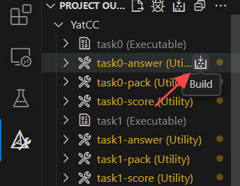
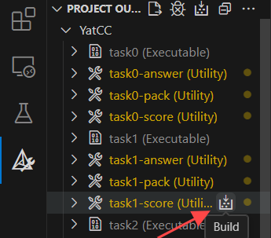
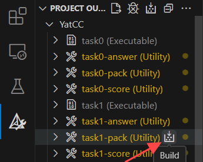

# 实验介绍

<div class="quote-card">
   <p class="quote-card__eyebrow">Task 1 · 词法分析 / Lexical Analysis</p>
   <p class="quote-card__text">&quot;The limits of my language mean the limits of my world.&quot;</p>
   <p class="quote-card__translation">（我语言的局限，即是我世界的局限。）</p>
   <p class="quote-card__author">Ludwig Wittgenstein</p>
</div>

!!! note "先让输出接近 clang，再追求实现优雅"

      Task1 最有效的做法是不断对照标准输出，把 token、位置信息和额外标志逐项补齐。
      先建立正确性，再考虑代码结构是否足够整洁。

## 任务描述

本次实验中需要实现一个简单的词法分析器，它接收经过预处理的源代码，输出词法分析的结果。

---

`/YatCC/test/cases`路径下存放了本实验所有的测试用源代码文件。以`/YatCC/test/cases/functional-0/000_main.sysu.c`为例，其内容如下所示：

```cpp
int main(){
    return 3;
}
```

其经过`clang`预处理后，我们可以在`/YatCC/build/test/task0/functional-0/000_main.sysu.c`得到以下内容：

```cpp
# 1 "./functional-0/000_main.sysu.c"
# 1 "<built-in>" 1
# 1 "<built-in>" 3
# 384 "<built-in>" 3
# 1 "<command line>" 1
# 1 "<built-in>" 2
# 1 "./functional-0/000_main.sysu.c" 2
int main(){
    return 3;
}
```

相比源代码，多了一些以`#`开头的行。这些行是`clang`在预处理过程中插入的，称之为**行标记**（Linemarkers）。

!!! warning "不要把行标记当成普通源码内容"

   Task1 最容易忽略的就是这些以 `#` 开头的预处理信息。它们虽然不是待识别的普通 token，但却决定了后续文件名、行号和列号能否对齐。
   如果这里处理思路错了，后面的 Loc 基本都会跟着错。

行标记的基本格式是`# linenum filename flags`，它的含义是**下一行**来自于`filename`文件的第`linenum`行。例如`# 1 "./functional-0/000_main.sysu.c 2"`表示下一行`int main(){`来自于`./functional-0/000_main.sysu.c`文件的第 1 行。

至于`flags`的含义以及更多行标记的细节可以参考[这里](https://gcc.gnu.org/onlinedocs/cpp/Preprocessor-Output.html)，此处不再赘述。

---

用`clang`进一步对预处理后的源代码进行词法分析，其结果如下，该信息可以在`/YatCC/build/test/task1/functional-0/000_main.sysu.c/answer.txt`找到：

```cpp
int 'int'  [StartOfLine]  Loc=<./functional-0/000_main.sysu.c:1:1>
identifier 'main'  [LeadingSpace]  Loc=<./functional-0/000_main.sysu.c:1:5>
l_paren '('  Loc=<./functional-0/000_main.sysu.c:1:9>
r_paren ')'  Loc=<./functional-0/000_main.sysu.c:1:10>
l_brace '{'  Loc=<./functional-0/000_main.sysu.c:1:11>
return 'return'  [StartOfLine]  [LeadingSpace]  Loc=<./functional-0/000_main.sysu.c:2:5>
numeric_constant '3'  [LeadingSpace]  Loc=<./functional-0/000_main.sysu.c:2:12>
semi ';'  Loc=<./functional-0/000_main.sysu.c:2:13>
r_brace '}'  [StartOfLine]  Loc=<./functional-0/000_main.sysu.c:3:1>
eof ''  Loc=<./functional-0/000_main.sysu.c:3:2>
```

其中每行开头的单词是后面单引号包裹的词法单元的别名, `[StartOfLine]` 表示该词法单元位于所在行的行首，`[LeadingSpace]`表示该词法单元前面存在空格。

`Loc`中的内容则是代表词法单元**在源代码文件中**所处的位置。例如`Loc=<./functional-0/000_main.sysu.c:1:1>`就表示这个词法单元位于`./functional-0/000_main.sysu.c`文件的第 1 行第 1 列（都是从 1 开始计数）。

---

本次实验的目标，就是自己实现一个词法分析器，输入经过预处理的源代码，能够得到和上面一样的结果！同学们需要完成的工作总结如下：

1. 补充更多的`token`定义
2. 提取`Loc`信息，包括简单的`token`行号以及列号
3. 提取`token`所在的文件名（文件名位于以`#`开头的预处理信息中）
4. 判断`[StartOfLine]`和`[LeadingSpace]`是否需要输出

同学们可能会想，实现这样的一个词法分析器的工程量应该很大吧？设计实验以及编写文档的助教和大家的想法是一样的！所以肯定不会让大家从零开始实现一个词法分析器。在`task1`中我们提供了`flex`和`antlr`两种框架来实现我们的词法分析器，其中`antlr`在`task2`中还会继续用到。同学们可以自由选择自己喜欢的框架进行实现。

!!! tip "如果你打算继续走 ANTLR，Task1 就尽量选同一路线"

   ANTLR 在 Task2 中还会继续使用。如果你已经确定后面想沿用同一套工具链，Task1 直接用 ANTLR 往往能减少切换成本。
   如果你更想先快速理解词法规则与匹配过程，flex 也会更直接。

## 实验步骤

1. 预处理源代码

   在`PROJECT OUTLINE/YatCC/test/task0`中选择构建`task0-answer`。该操作将自动将所有`YatCC/test/cases/*/*.sysu.c`源代码进行预处理。预处理结果将保存在`YatCC/build/test/task0`文件夹中，作为词法分析器的输入。

   

2. 实现词法分析器

   本次实验可以选择使用`flex`或`antlr`实现词法分析器，需要在`/YatCC/config.cmake`中设置`TASK1_WITH`为`"flex"`或`"antlr"`。设置完成后，同学们可以自由编写`YatCC/task/1/flex`或`YatCC/task/1/antlr`中的源代码。

   完成源代码编写后，可以通过`PROJECT OUTLINE/YatCC/test/task1`中选择构建`task1-score`进行实验一的评分。完成所有样例测评后，每个样例的标准输出`answer.txt`、实际输出`output.txt`和评分结果`score.txt`将保存在`YatCC/build/test/task1`文件夹中，同学们可以根据评分结果对比标准输出和实际输出，并进行代码修改。

   

   实验要求能够正确输出除`eof`和不可见字符外的所有词法单元的别名、所属的源文件的路径以及在源文件中的位置。为了简化，对于文件结束符`eof`，我们仅判断其是否被正确识别并输出别名，而不进行词法单元位置和源文件路径的判断。

   !!! note "先保大头分，再补细节"

      调试顺序建议是：先让 token 别名正确，再补 Loc，最后补 `[StartOfLine]` 和 `[LeadingSpace]`。
      不要一开始就同时追四类输出，否则很难判断当前到底是哪一部分出了问题。

3. 打包提交

   完成实验后，请通过构建`PROJECT OUTLINE/YatCC/task/task1-score`进行实验一源代码打包并提交至测评机进行正式测评，打包结果将保存于`/YatCC/build/task`中。

   

## 评分标准

- 是否提取出正确的 Token (60 分)
- 是否提取出正确的 token location (30 分)
- 是否识别出其他无关的字符 (10 分)

注：`eof`这个 token 的位置和源文件路径不计入评分。

!!! danger "不要被 eof 细节拖住进度"

   `eof` 需要被识别，但它的位置和源文件路径不计分。
   如果你已经在别名、Loc 和空白标志上还有明显缺口，不要把大量时间花在 `eof` 的边角行为上。

## 脚本说明

与实验一相关的脚本说明如下：

- `/YatCC/config.cmake`：根据个人需要，设置实验一的实现方式`TASK1_WITH`为`"flex"`或`"antlr"`。
- `/YatCC/task/1/CMakeLists.txt`：根据`TASK1_WITH`选择编译工具为`"flex"`或`"antlr"`，并使用相应工具生成词法分析器`task1`。
- `/YatCC/test/task1/CMakeLists.txt`：主要包含两个构造目标：
  - `task1-answer`：调用同文件夹下的`answer.sh`，使用`clang -cc1 -dump-tokens *.sysu.c`指令生成所有测例的标准词法分析结果。
  - `task1-score`：调用同文件夹下的`score.py`，将`task1`生成的输出与`clang`生成的标准答案进行比较，最终统计各测例得分。评分时会根据测例权重文件对各测例得分进行加权计算总得分。
    同时，本文件还包含为每个测例创建测试的代码，方便同学们使用断点调试功能（相关用法已在“如何调试代码”介绍，此处不再赘述）。
