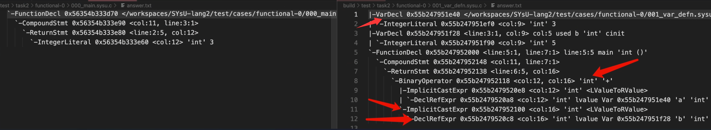
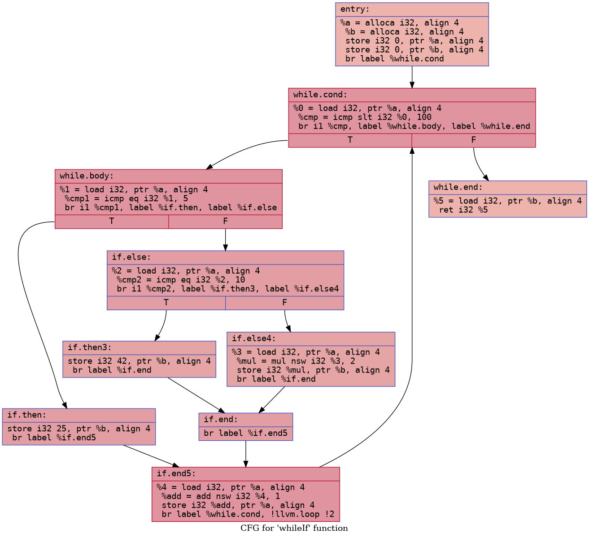

# 上手教程

本次实验中需要同学们修改的代码只有`EmitIR.cpp`和`EmitIR.hpp`。和实验二中一样，对于某一种语法结构，我们可能需要添加一个处理函数，其中这个函数的主体我们需要在`EmitIR.cpp`中编写，同时将其函数声明写到`EmitIR.hpp`中。接下来通过带领大家完善代码，通过测试样例二，让同学们了解完成实验的过程，帮助大家快速上手。

---

测例 1 和测例 2 的源代码如下，

```c
// 000_main.sysu.c
int main(){
  return 3;
}

// 001_var_defn.sysu.c
int a=3;
int b=5;
int main(){
  return a + b;
}
```

对比两份代码在实验二中的标准答案，也即 JSON 文件：



可以发现实际上测例 2 比测例 1 多了几种语法结构需要我们进行处理，它们分别是

- 变量声明 `VarDecl`，对应`int a=3;`
- 声明引用表达式 `DeclRefExpr`，对应`a + b` 表达式中的 `a` 和 `b`
- 加法表达式，对应`a + b`
- 隐式类型转换`ImplicitCastExpr`，在加法运算前将左值转换为右值

## 处理变量声明

第一步，处理`VarDecl`。

我们需要在对`Decl`进行处理的`operator()`重载中，加入对变量声明`VarDecl`的跳转：

```cpp
void
EmitIR::operator()(Decl* obj)
{
  // TODO: 添加变量声明处理的跳转
  if (auto p = obj->dcst<VarDecl>())
    return self(p);

  if (auto p = obj->dcst<FunctionDecl>())
    return self(p);

  ABORT();
}
```

添加了对`VarDecl`的处理跳转之后，我们需要在`EmitIR.cpp`中实现处理`VarDecl`的`operator()`重载，并在`EmitIR.hpp`中声明它。需要同学们注意的是，第二个测试样例不仅存在变量的声明，并且还存在变量的值初始化。为了使得我们的实现更加清晰简洁，我们将变量的声明和初始化分开进行实现。

此时请同学们跳转到 task3 文档中[LLVM API-全局变量-创建全局变量](task3_doc/apidoc.md#create-global-variable)部分，其中描述了创建全局变量的 API 以及相关的参数说明。

其中创建全局变量的 API 如下：

```cpp
#include <llvm/IR/GlobalVariable.h>

/// M：            llvm::Module实例，包含所有 LLVM IR 的顶层容器
///                  全局变量创建完成后将会自动插入 M 的符号表中
/// Ty：            全局变量的类型
/// isConstant：    是否是常量
/// Linkage：    全局变量的链接类型，如是否被外部函数可见
/// Initializer：初始值
/// Name：        全局变量的名字
/// 其他参数在本次实验中可以不用关注
GlobalVariable(Module &M, Type *Ty,
               bool isConstant, LinkageTypes Linkage,
               Constant *Initializer, const Twine &Name="",
               GlobalVariable *InsertBefore=nullptr,
               ThreadLocalMode=NotThreadLocal,
               std::optional< unsigned > AddressSpace=std::nullopt,
               bool isExternallyInitialized=false);
```

利用全局构造函数进行初始化的过程如下：

```cpp
/// 举个简单的例子，例如：int a = 10

/// 1. 创建全局变量，并为全局变量暂时先指定零初始化
llvm::Type *ty = llvm::Type::getInt32Ty(TheContext);
llvm::GlobalVariable *gloVar =
    new llvm::GlobalVariable(TheModule, ty, false, /* Not constant */
                             llvm::GlobalValue::ExternalLinkage,
                             nullptr /* 初始值为 nullptr */, "glolVar");
/// 零初始化
gloVar->setInitializer(llvm::Constant::getNullValue(ty));

/// 2. 创建函数，完成为全局变量进行初始化的逻辑
/// 函数返回值为 void，无参数
/// 函数名字为 ctor
llvm::Function *ctorFunc = llvm::Function::Create(
    llvm::FunctionType::get(llvm::Type::getVoidTy(TheContext), false),
    llvm::GlobalValue::PrivateLinkage, "ctor", &TheModule);
/// 为函数 ctorFunc 创建 entry 基本块
llvm::BasicBlock *entryBlock = llvm::BasicBlock::Create(TheContext, "entry", ctorFunc);
/// 设置 LLVM IR 插入点为 entry 基本块
TheBuilder.SetInsertPoint(entryBlock);
/// 创建 store 指令将常量1存入全局变量 gloVar
TheBuilder.CreateStore(llvm::ConstantInt::get(llvm::Type::getInt32Ty(TheContext), 10), gloVar);

/// 3. 将函数添加至模块 TheModule 的全局构造函数数组中,65535为优先级
///    优先级数值越大执行时间越靠后，优先级数值最大值为65535
///    模块被加载时，全局构造函数数组中的全局构造函数将按照优先级依次执行
llvm::appendToGlobalCtors(TheModule, ctorFunc, 65535);

```

所以最终我们写出的处理全局变量声明以及初始化的两个函数如下

```cpp
void
EmitIR::trans_init(llvm::Value* val, Expr* obj)
{
  auto& irb = *mCurIrb;

  // 仅处理整数字面量的初始化
  if (auto p = obj->dcst<IntegerLiteral>()) {
    auto initVal = llvm::ConstantInt::get(self(p->type), p->val);
    irb.CreateStore(initVal, val);
    return;
  }

  // 如果表达式不是整数字面量，则中断编译
  ABORT();
}

void
EmitIR::operator()(VarDecl* obj)
{

  auto ty = llvm::Type::getInt32Ty(mCtx); // 直接使用 LLVM 的 int32 类型
  auto gvar = new llvm::GlobalVariable(
    mMod, ty, false, llvm::GlobalVariable::ExternalLinkage, nullptr, obj->name);

  obj->any = gvar;

  // 默认初始化为 0
  gvar->setInitializer(llvm::ConstantInt::get(ty, 0));

  if (obj->init == nullptr)
    return;

  // 创建构造函数用于初始化
  mCurFunc = llvm::Function::Create(
    mCtorTy, llvm::GlobalVariable::PrivateLinkage, "ctor_" + obj->name, mMod);
  llvm::appendToGlobalCtors(mMod, mCurFunc, 65535);

  auto entryBb = llvm::BasicBlock::Create(mCtx, "entry", mCurFunc);
  mCurIrb->SetInsertPoint(entryBb);
  trans_init(gvar, obj->init);
  mCurIrb->CreateRet(nullptr);
}
```

然后在`EmitIR.hpp`中添加如下内容

```cpp
void trans_init(llvm::Value* val, asg::Expr* obj);
void operator()(asg::VarDecl* obj);
```

至此，我们以及完成了对变量声明的处理。

## 处理表达式

第二步，处理`DeclRefExpr`、`ImplicitCastExpr` 和 `BinaryExpr`三个表达式。

首先在`EmitIR.hpp`加入以下函数声明：

```cpp
llvm::Value* operator()(asg::BinaryExpr* obj);
llvm::Value* operator()(asg::ImplicitCastExpr* obj);
llvm::Value* operator()(asg::DeclRefExpr* obj);
```

然后在`EmitIR.cpp`的重载函数`EmitIR::operator()(Expr* obj)`中添加如下跳转处理，

```cpp
llvm::Value*
EmitIR::operator()(Expr* obj)
{
  // TODO: 在此添加对更多表达式处理的跳转
  if (auto p = obj->dcst<IntegerLiteral>())
    return self(p);

  if (auto p = obj->dcst<DeclRefExpr>())
    return self(p);

  if (auto p = obj->dcst<ImplicitCastExpr>())
    return self(p);

  if (auto p = obj->dcst<BinaryExpr>())
    return self(p);

  ABORT();
}
```

---

接着实现`ImplicitCastExpr`的`operator()`重载：

```cpp
llvm::Value*
EmitIR::operator()(ImplicitCastExpr* obj)
{
  auto sub = self(obj->sub);

  auto& irb = *mCurIrb;
  switch (obj->kind) {
    case ImplicitCastExpr::kLValueToRValue: {
      auto ty = self(obj->sub->type);
      auto loadVal = irb.CreateLoad(ty, sub);
      return loadVal;
    }

    default:
      ABORT();
  }
}
```

来逐行解释一下：

- `auto sub = self(obj->sub)`

  - `obj->sub` 获取 `ImplicitCastExpr` 中包含的子表达式，即要进行类型转换的表达式。
  - `self(obj->sub)` 调用 `EmitIR` 类的另一个重载运算符，用于处理子表达式并返回其在 LLVM IR 中的表示。

- `auto& irb = *mCurIrb`：

  - `mCurIrb` 是指向当前 LLVM IR 构建器（`IRBuilder`）的指针。`IRBuilder` 是一个辅助类，用于生成 LLVM IR 指令。
  - 通过解引用获取当前 IR 构建器的引用，用于在接下来的代码中方便地生成各种 LLVM IR 指令。

- `switch` 语句：

  处理不同类型的[隐式转换](task2_doc/share.md#type-check)。这里只处理了 `ImplicitCastExpr::kLValueToRValue` 一种情况，也即将一个左值（例如变量的地址）转换为一个右值（例如变量的内容）。这在 C++中很常见，比如在表达式中使用变量时通常需要获取这个变量的值而非变量本身。

  - `auto ty = self(obj->sub->type)`：获取子表达式的类型，并调用 `self` 方法将类型转换为 LLVM IR 中对应的类型表示。
  - `auto loadVal = irb.CreateLoad(ty, sub)`：
    - 使用 IR 构建器创建一个 `load` 指令（参考[LLVM API-局部变量-load 指令](task3_doc/apidoc.md#load-instruction)），从由 `sub` 指定的地址（子表达式的结果，即一个左值）加载一个值。
    - `ty` 指定了加载值的类型，确保正确地解释内存中的数据。
  - `return loadVal`： 将加载的值（现在是一个右值）作为函数的返回值。

由此，这段代码就实现了从左值到右值的隐式类型转换。

---

接下来实现处理`DeclRefExpr`的`operator()`重载：

```cpp
llvm::Value*
EmitIR::operator()(DeclRefExpr* obj)
{
  // 在LLVM IR层面，左值体现为返回指向值的指针
  // 在ImplicitCastExpr::kLValueToRValue中发射load指令从而变成右值
  return reinterpret_cast<llvm::Value*>(obj->decl->any);
}
```

还记得我们在处理变量声明时，有一行`obj->any = gvar`吗？`Obj`基类的`any`成员终于派上了用场！这里我们将指向`llvm::GlobalVariable`对象的指针，转换为`llvm::Value*`类型并返回，这就相当于返回了之前声明了的变量的地址。利用这个`llvm::Value*`指针，就可以利用`CreateStore`指令将值存储到这个地址中（变量赋值）等操作了。

在局部变量声明的时候，不要忘了给`any`成员赋值哦！

---

最后处理加法表达式。在进行这一小节的代码编写之前，同学们也需要先提前查阅[LLVM API-二元表达式-整数加法+](task3_doc/apidoc.md#integer-addition)。具体的实现如下：

```cpp
llvm::Value*
EmitIR::operator()(BinaryExpr* obj)
{
  llvm::Value *lftVal, *rhtVal;

  lftVal = self(obj->lft);

  auto& irb = *mCurIrb;
  rhtVal = self(obj->rht);
  switch (obj->op) {
    case BinaryExpr::kAdd:
      return irb.CreateAdd(lftVal, rhtVal);

    default:
      ABORT();
  }
}
```

来逐行解释一下：

- `llvm::Value *lftVal, *rhtVal`: 定义两个指向 `llvm::Value` 的指针，分别用来存储二元表达式左侧和右侧子表达式的结果。

- `lftVal = self(obj->lft)`: 调用 `self()` 函数（或方法）来处理左侧子表达式 (`obj->lft`)，并获取其在 LLVM IR 中的表示。`self()` 函数处理各种类型表达式，并返回其 IR 表示。

- `auto& irb = *mCurIrb`: 通过解引用 `mCurIrb` 指针获取当前的 `IRBuilder` 实例的引用。

- `rhtVal = self(obj->rht)`: 与处理左侧子表达式类似，调用 `self()` 函数处理右侧子表达式 (`obj->rht`)，获取其 IR 表示。

- `switch` 语句：根据表达式的操作符 (`obj->op`) 决定如何处理表达式。
  - `case BinaryExpr::kAdd`: 对于加法操作符 `kAdd`，使用 `irb.CreateAdd(lftVal, rhtVal)` 生成一个加法指令。
  - `CreateAdd()` 是 `IRBuilder` 类的一个方法，它接受两个 `llvm::Value*` 类型的参数，生成一个新的加法指令，并返回结果的 IR 表示。

## 阶段性结果

至此，针对样例 2，我们已经实现了所有所需的处理函数。运行评分脚本，应该能得到如下图所示的评分结果，可以看到测例 2 已经拿到了满分！


接下来几个小节，选择性介绍其他语法结构的处理方式，供同学们参考。

## 处理语句

处理语句时，尤其是复合语句、条件语句、循环语句等，会涉及到控制流的设计，包括[基本块](task3_doc/apidoc.md#basic-block)的创建、插入点的切换以及不同基本块之间的跳转。

以`if`语句为例：

```c
if(cond){ // prev
  //then
} else{
  //else
}
//merge
```

通常可以分为这四个区域，也对应着四个基本块：

- `prev`：在进入`if`语句之前的基本块，可以就在这个基本块中，开始生成关于条件表达式的 IR 代码。
- `then`：条件为真时，应当执行的基本块。需要创建该基本块，并调整插入点到这个基本块之后，再生成这部分的 IR 代码。
- `else`：条件为假时，应当执行的基本块。需要创建该基本块，并调整插入点到这个基本块之后，再生成这部分的 IR 代码。
- `merge`：各个分支最终要回到的基本块，后续的 IR 代码也将会直接插入到这个基本块中（变成别的语句的`prev`）。

按照上面的设计，一种参考实现如下：

```cpp
void
EmitIR::operator()(IfStmt* obj)
{
  auto& irb = *mCurIrb;

  auto thenBb = llvm::BasicBlock::Create(mCtx, "if.then", mCurFunc);
  auto elseBb = llvm::BasicBlock::Create(mCtx, "if.else", mCurFunc);
  auto mergeBb = llvm::BasicBlock::Create(mCtx, "if.end", mCurFunc);

  // 直接在原基本块开始判断if的条件
  auto condVal = self(obj->cond);
  // 根据条件值跳转到不同的基本块
  irb.CreateCondBr(condVal, thenBb, elseBb);

  // 处理then部分
  irb.SetInsertPoint(thenBb);
  self(obj->then);
  // 跳转到mergeBb
  irb.CreateBr(mergeBb);

  // 处理else部分
  irb.SetInsertPoint(elseBb);
  self(obj->else_);
  // 跳转到mergeBb
  irb.CreateBr(mergeBb);

  // 调整插入点到mergeBb，方便后续的代码生成
  mCurIrb->SetInsertPoint(mergeBb);
}
```

注意，上面的代码仅供参考，`if`语句可能没有`else`，也可能有嵌套关系。`thenBb`和`elseBb`之中也可能有`return`直接返回了，不需要再跳转到`merge`（否则会在同一个基本块中生成了多个[终结指令](task3_doc/apidoc.md#basic-block-terminator)而报错），同学们需要考虑各种情况，并进行相应的处理。

其他语句的处理也是类似的。特别地，对于`break`和`continue`语句，不是在同一个重载函数中处理，无法拿到需要跳转到的基本块。一种可能的解决方法是，给`EmitIR`类添加一个成员变量，保存所需的基本块指针，以便后续使用。

## 处理数组元素访问

在我们的 LLVM API 文档中，介绍了使用`GEP`指令来实现[数组元素访问](task3_doc/apidoc.md#array-element-access)：

```cpp
/// 根据索引列表，将指针偏移量应用于基指针，获得结果指针
/// Ty：      基指针 Ptr 指向的数据的类型
/// Ptr：     基指针
/// IdxList： 索引列表
Value *CreateInBoundsGEP(Type *Ty, Value *Ptr, ArrayRef<Value *> IdxList, const Twine &Name="");
```

我们需要的三个参数，分别是基指针指向的类型、基指针和索引列表。对于一个实际的数组元素访问表达式，例如：

```cpp
// 029_const_array_defn.sysu.c
int a[5];
// ...
return a[4];
```

其中的`a[4]`转化为的 AST 结构如下：

```json
"kind": "ImplicitCastExpr",
"type": {
  "qualType": "int"
},
"valueCategory": "prvalue",
"castKind": "LValueToRValue",
"inner": [
  {
    "kind": "ArraySubscriptExpr",
    "type": {
      "qualType": "const int"
    },
    "valueCategory": "lvalue",
    "inner": [
      {
        "kind": "ImplicitCastExpr",
        "type": {
          "qualType": "const int *"
        },
        "valueCategory": "prvalue",
        "castKind": "ArrayToPointerDecay",
        "inner": [
          {
            "kind": "DeclRefExpr",
            "type": {
              "qualType": "const int[5]"
            },
            "valueCategory": "lvalue"
          }
        ]
      },
      {
        "kind": "IntegerLiteral",
        "type": {
          "qualType": "int"
        },
        "valueCategory": "prvalue",
        "value": "4"
      }
    ]
  }
]
```

对于`a`，最内层首先是一个`DeclRefExpr`，表示对变量的引用。然后再外层是一个`kArrayToPointerDecay`的`ImplicitCastExpr`，表示将数组转换为指针，在这个例子中，就是希望把`int[5]`类型的数组转换为`int*`类型。再外面是一个`ArraySubscriptExpr`，转化为 ASG 节点，是一个`kIndex`类型的`BinaryExpr`，表示数组下标访问。我们最终，就是要在`BinaryExpr`的重载中，调用`CreateInBoundsGEP()`函数。

按照我们之前实现的处理`DeclRefExpr`重载，会返回一个`llvm::Value*`指针。如果对其用`getType()`，得到的是`ptr`，而不是`i32*`，这是因为在 LLVM 17 中，所有的指针类型都是[不透明指针](task3_doc/apidoc.md#pointer-type)。而且`getElementType()`以及`getPointerTo()`等函数都已经被弃用，无法根据这个指针类型，获取它所指向的类型。

如果能获取到指针指向的类型，我们可以像下面这样写：

```cpp
// operator()(ImplicitCastExpr* obj)
case kArrayToPointerDecay: {
  auto sub = self(obj->sub);
  auto ty = sub->getType()->getPointerElementType();
  auto gep = irb.CreateInBoundsGEP(ty, sub, {irb.getInt32(0)});
  return gep;
}

// operator()(BinaryExpr* obj)
case kIndex: {
  auto sub = self(obj->lft);
  auto idx = self(obj->rht);
  auto ty= sub->getType()->getPointerElementType();
  auto gep = irb.CreateInBoundsGEP(ty, sub, {idx});
  return gep;
}
```

生成的 IR 类似：

```llvm
@a = constant [5 x i32]

define i32 @main() #0 {
entry:
  %0 = load i32, ptr getelementptr inbounds ([5 x i32], ptr @a, i64 0), align 16
  %1 = load i32, ptr getelementptr inbounds (i32, ptr %0, i64 4), align 16
  ret i32 %1
}
```

这与标准答案中的 IR 是等价的：

```llvm
@a = constant [5 x i32]

define i32 @main() #0 {
entry:
  %0 = load i32, ptr getelementptr inbounds ([5 x i32], ptr @a, i64 0, i64 4), align 16
  ret i32 %0
}
```

但是，我们以及无法获取指针所指向的类型了。一种可能的解决方法是**利用 ASG 节点的类型信息**，也即`obj->type`。假如你已经实现了数组类型的处理函数，可以`self(obj->type)`，回返回真实的类型（一个`llvm::Type*`），可以作为`CreateInBoundsGEP()`的第一个参数了。

以上思路仅供参考，具体的实现同学们可以根据自己的设计进行调整。

## 处理空初始化列表

在 task2 的[文档](task2_doc/share.md#type-check)中，提到空初始化列表实际上对应着一个`ImplicitInitExpr`的 ASG 节点，不要忘记给`operatoe()(Expr* obj)`添加相应的跳转处理。

## 如何调试

在本次实验中，建议同学们**渐进式**地进行补全，因为测例有限，不用也不要求同学们能够覆盖所有的语法结构（例如，测例中不存在使用指定初始化器的情况`int arr[3]={[2]=3}`，也不存在使用字符串字面量进行初始化的情况`char* str="hello"`）。同学们可以运行评分脚本，**从前往后**查看第一个没通过的样例，然后补充上这个样例所需的处理函数，再运行评分脚本，以此类推，直到通过所有的样例。

接下来，介绍几种同学们在做实验的过程中，可能出现的典型报错以及调试思路。

---

运行评分脚本后，如果某个样例报错**运行输出结果时出错/编译输出结果时出错**，大概率是因为你的代码没有覆盖某种结构，导致`emitIR()`函数提前中止，没能生成完整的 LLVM IR 文件（或者干脆为空），根据 IR 编译或者运行编译出的二进制文件时，自然会出错。

你可以通过[断点调试](introduction/howtouse.md#debug)，单独测试这个样例，定位具体是在`EmitIR.cpp`的哪里中止。你可以在代码中灵活添加`ABORT()`或者`printf()`等，帮助你定位。

也可以手动调用二进制：

```bash
./build/task/3/task3 ./build/test/task2/xxx/xxx.sysu.c/answer.json ./mylog.txt
```

这样，你可能可以看到更详细的报错信息。例如代码中的`ABORT()`会给出出错的行数，再比如主函数中的`llvm::verifyModule()`会验证生成的 LLVM IR，也会有报错信息。

你还可以结合这个样例的源代码（`/test/cases/xxx/xxx.sysu.c`），以及这个样例对应的 JSON 文件（`/build/test/task2/xxx/xxx.sysu.c/answer.simplied.json`，需要构建 task2-score 来得到），找到你的代码没能覆盖到的语法结构。

或者，你可以直接对比你生成的 IR 和标准答案（`/build/test/task3/xxx/xxx.sysu.c/answer.ll`），发现不同之处，然后加以改进。

---

运行评分脚本后，如果某个样例报错**用户答案运行输出格式有误，检查生成的代码是否有误**或者**输出不匹配**，说明你生成的 IR 能够正常通过编译并成功运行，但是程序的结果有误。这一般是因为你生成的 IR 出现了错误，大概率是处理控制流（也即条件语句和循环语句）或者变量初始化部分的代码有错误。

你可以对比你生成的 IR 和标准答案的 IR，发现不同之处。对于控制流出错的情况，当程序比较复杂时，直接看 IR 可能比较困难。可以配合使用`opt`、`dot`、`graphviz`工具，生成控制流图（CFG），帮助你更好的看出与标准答案的控制流差异。

首先安装必要的库：

```bash
apt install -y graphviz-doc libgraphviz-dev graphviz
```

然后用`opt`生成`.dot`文件：

```bash
opt -passes=dot-cfg /path/to/xxx.ll
```

这样会生给每个函数生成一个`.dot`文件，我们一般只需要查看`.main.dot`。最后利用`dot`生成控制流图片即可：

```bash
dot /path/to/.main.dot -Tpng -o /path/to/xxx.png
```

以`039_while_if_test1.sysu.c`这个样例中，`whileIf()`函数为例，其生成的控制流图如下：



---

由于我们编写的是生成 IR 的程序，无法通过修改`EmitIR.cpp`来打印出程序运行时变量的变化。在你正确实现了`CallExpr`的处理之后，一种比较“极端”的办法是，直接修改测例源码，利用`putint()`和`putch()`打印出变量的值，然后可以在`score.txt`中看到标准输出和用户输出。

修改完测例源码后，由于缓存的存在，你需要将`/build`文件夹整个删掉后，重新构建 task3-score，才能应用修改。

注意！测试完成后，你需要**将样例复原**，再以原样例进行测试，否则可能会因为与测试平台的样例不一致，对你的成绩产生影响。
