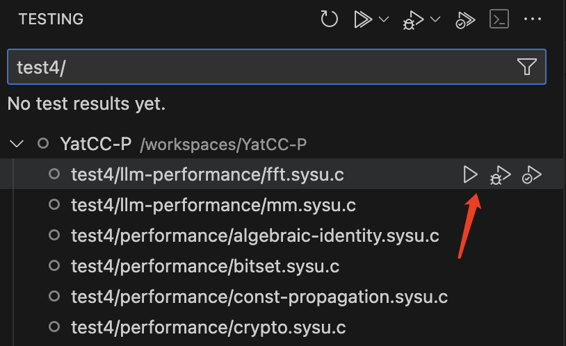
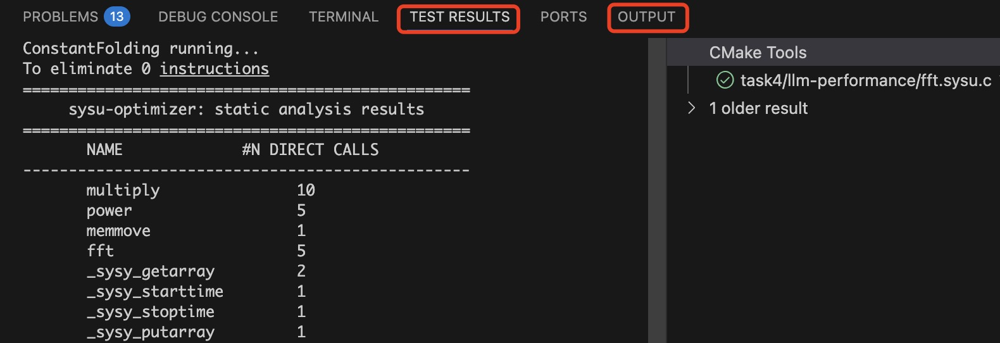

## 任务描述

恭喜同学们顺利完成前面三个实验！通过前面的实验，我们已经实现了一个包括词法分析、语法分析和中间代码生成功能在内的编译器前中端。编写一个编译器，除了需要保证生成的程序能够得到正确的结果，还需要保证程序的性能。对于一个成熟的编译器，**中间代码优化**是非常重要的一个部分，它属于编译器后端的一部分，负责完成与平台无关的通用优化。这个部分让我们在编程时能够更专注于代码逻辑而非如何提高代码运行性能，降低编写高性能程序的难度。

在本次实验中，需要实现一个 LLVM IR 优化器，有两种实现路线，均需要同学们去完成：

- **传统方法**：编写 LLVM Pass，实现经典编译优化算法
- **大语言模型方法**：编写代码，调用大语言模型优化中间代码

实验的输入与输出均为 LLVM IR，要求同学们在保证代码正确性的基础上面向给定测试样例进行代码优化。

在 LLVM 中，中端优化函数以 Pass 的形式存在，其作用是对输入的 LLVM IR 进行分析与变换，并输出变换后的 LLVM IR。每个优化由一个或多个 Transform Pass 实现，不同优化的 pass 之间相互独立。本次实验没有标准答案，同学们可以自由发挥，借助任何可能的优化方法提升程序的运行效率，并通过测评系统测评。

## 评分标准

本实验需要分别使用传统方法和大语言模型方法实现，两部分测例独立，前者可在 `YatCC/test/cases/performance/` 目录下查看，后者则在 `YatCC/test/cases/llm-performance` 目录下查看。两部分实验测例独立评分、赋分，最后加权求和作为实验四的总分。

对于每种方法，评分均考虑两个方面——**正确性**与**程序运行性能**，比较对象为 clang 开启 O2 优化后生成的程序（下称**标准程序**）以及：

- 正确性：对于一个编译器而言，正确性是必然的。对于每个实验测例，将比较同学们优化后的程序与标准程序的输出和返回值：
  - 若两者的输出和返回值完全相同，则正确性测试通过，进入性能测试
  - 若两者的输出和返回值不相同，则该部分实验得分直接为 0，不会考虑其他测例的测评情况。
- 程序运行性能：通过正确性验证后，进行性能测试。对于单个实验测例，其得分为标准程序的运行时间与同学们优化后的程序运行时间求比值后开平方，再乘以 100（单个测例最高分为 100 分）。某部分实验的得分，为这部分实验所有测例的得分的均值。最终传统方法和大模型方法按照 5:1 的比例进行加权求和，得到性能总分。

上面得到的性能总分并非该实验的最终分数，同学们不需要追求性能满分。我们还将综合考虑同学们实现的优化算法、在测评系统中排行榜的排名进行赋分，测例也可能会修改，**以最终公示的评分规则为准**。

---

本次实验不允许出现以下行为，**若出现以下行为将视为作弊与抄袭**：

- 通过识别文件名、输入、特定代码段等，面向测例进行优化
- 直接调用 LLVM 内置的 **Transform Pass**，或者直接复制 LLVM 提供的 Transform Pass 代码进行优化

我们允许以下行为：

- 在理解 LLVM 优化源代码的基础上将其简化移植
- 使用 LLVM 提供的 **Analysis Pass** 获取优化所需的信息（Transform Pass 和 Analysis Pass 的区别是前者执行后会修改 LLVM IR，而后者仅返回信息不改变 IR）

我们鼓励同学们：

- 实现实验文档/测例中未涉及到的优化方法，并提供相应测例，并在实验报告中说明。我们将在分析优化效果与实现难度后酌情加分。
- 积极探索将 LLM 融入编译优化的方法，通过调用 LLM 来获得期望的编译优化信息辅助优化决策，实现 **LLM for Compiler**

## 调试方法

### 输出调试

同学们可以使用本项目提供的[调试功能](introduction/howtouse.md#debug)对单个测例进行调试：



`task4/xxx/xxx.sysu.c` 系列测试仅查看优化器代码能否通过编译、正常优化 LLVM IR 以及输出优化后的 LLVM IR，而 `test4/xxx/xxx.sysu.c` 系列测试在前者的基础上，还会对测例评分，方便查看优化效果（具体差别可以查看`YatCC/test/task4/CMakeLists.txt`）。

前者的输出可在 VSCode 的 `OUTPUT`（输出，是 CTest 的输出）和 `TEST RESULTS`（测试结果，一般为程序输出到标准错误流 `stderr` 的内容）中直接查看。后者的输出可以在`/YatCC/build/test/task4/Testing/Temporary/LastTest.log`文件中查看。



---

你也可以手动调用优化器程序，对特定样例进性测试。二进制程序存放在`/YatCC/build/task/4/`目录下，传统方法和大语言模型方法生成的二进制程序分别为 `task4-classic` 和 `task4-llm`。

手动调用前，应该先构建一遍 task4 目标，再像下面这样调用：

```bash
task4_out=/YatCC/build/task/4
test3_out=/YatCC/build/test/3
case=functional-0/000_main.sysu.c
output_dir=/YatCC/build/test/4/functional-0/000_main.sysu.c
# 或者 task4=task4-llm
task4=task4-classic

# 优化LLVM IR
${task4_out}/${task4} ${test3_out}/${case}/answer.ll ${output_dir}/output.ll > ${output_dir}/output.log
```

最终输出结果将重定向到`${output_dir}/output.log`中。


### 测例修改

在实验时，可能需要修改测例以验证优化是否可行。由于缓存机制，需要删除整个`/YatCC/build`文件夹后，按下面的方式重新构建项目：


重新构建后，再使用命令行编译调试单个测例：

```shell
rtlib_include=/YatCC/test/rtlib/include
rtlib_path=/YatCC/build/test/libtest-rtlib.so
case_path=/path/to/your/code.sysu.c
ll_path=/path/to/code.ll
opt_path=/path/to/code_opt.ll
bin_path=/path/to/code_opt
CC=/opt/YatCC/llvm/install/bin/clang
# 或者 task4=task4-llm
task4=task4-classic

# 生成LLVM IR
${CC} -cc1 -O0 -S -emit-llvm -isystem ${rtlib_include} ${case_path} -o ${ll_path}

# 优化LLVM IR
${task4_out}/${task4} ${ll_path} ${opt_path}

# 将LLVM IR编译为二进制文件
${CC} -O0 ${opt_path} ${rtlib_path} -o ${bin_path}
```

如果同学们觉得这样比较麻烦，也可以删除文件夹之后，直接构建 task4-score 目标，这样将对的所有测例进行编译、优化和评分，自然也就包括你刚才修改的样例，但是耗时会比较长。
