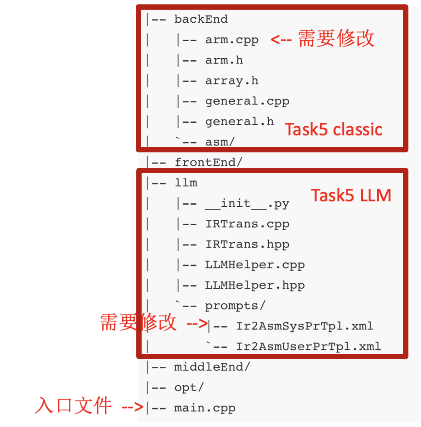

# Backend

# 整体介绍

恭喜同学们完成前四个实验，在实验一到四中，同学们已经分别完成了词法分析器，语法分析器，中间代码生成器以及中间代码优化器。在前四个实验中，同学们已经完成了编译器的前端和中端部分，在本次实验中，同学们将需要完成编译器的**后端指令选择**部分。

在本次实验中，有两种实现路径

- **传统方法**：补充框架代码关键逻辑，实现指令选择功能
- **大语言模型方法**：补充Prompts，引导大语言模型完成从IR到ARM汇编的转变

# 任务描述

## 概述

在本次实验中，同学们需要完成后端代码生成中的指令选择部分，完成IR到Machine IR的转换。

从ASG转换到ARM汇编需要很多步骤，如下图所示


需要进行指令选择转换成含虚拟寄存器的Machine IR，然后进行寄存器分配，将虚拟寄存器与实际寄存器进行绑定，然后经过窥孔优化进行一些简单的优化（强度衰减、常量折叠等），最后进行栈帧管理，用于组织局部变量、保存上下文信息等。

而指令选择是将平台无关的 LLVM IR 翻译成 平台相关的 Machine IR部分。Machin IR是在 LLVM IR 和目标机器指令之间的过渡表示，其更贴近底层硬件指令，且与平台相关，需要添加许多目标平台的特性，拥有以下特征

- 虚拟寄存器：指令操作数存放在虚拟寄存器中，通过寄存器分配后放入实体寄存器
- 平台相关性：指令的类型功能与ARM一致

在本次实验中，同学们将会用到一个针对arm v8a 32位后端的迷你编译器，编译器中已经包含了前端，中端以及后端的部分代码实现。


## 实验任务

Task5分别两个部分，Classic部分和LLM部分，在Classic部分**同学们需要编写代码，根据迷你编译器中端输出的IR，进行指令选择，将IR转换为对应于后端机器的Machine IR。**助教已经为同学们写好了寄存器分配等其他部分的代码。在LLM部分，同学们需要**编写Prompt指导LLM**，将中端输出的IR直接翻译为汇编代码。本次实验中没有标准答案，同学们可以根据IR选择认为合适的指令，也可以在汇编层面进行优化，只需要确保最后编译出来的二进制程序的正确性即可。

Task5属于**选做实验，**提供额外的**10分**（可补前面扣的分，总成绩封顶100分）

### Classic实验代码流程

后端指令选择部分的代码调用逻辑是自顶向下的，最终由指令开始生成，一步步向上，到基本块再到整个函数。具体而言之，整个调用逻辑由 `emit_asm` （负责生成整个程序的asm）→ `emit_function_asm` → `emit_instruction` （不同指令有不同的emit函数）。

### Classic相关文件

同学们需要修改的是 `backend/arm.cpp`文件。补充留空的部分，具体而言之，需要补充 `emit_Move` `emit_Branch` `emit_Icmp` `emit_Binary` `emit_Return` ，已经使用注释**task5 begin**，**task5 end**将其分割。

### LLM相关文件

同学们需要修改的是 `llm/prompts/Ir2AsmSysPrTpl.xml`  `llm/prompts/Ir2AsmUserPrTpl.xml`文件，补充完成里面给LLM的Prompt。




# 评判标准

本实验属于**附加**实验，并不要求所有同学完成，完成的同学会有额外的加分，最多为**10分**（封顶100分）。

本实验的评分只考虑同学们生成的二进制文件的正确性，同学们生成的汇编代码不必与标准答案相同，只需要汇编代码执行后的返回值与标准答案相同即可。

本实验的评分基于一组测试用例进行自动评测。每个测试用例的评分将通过比较同学们编译器生成的汇编代码与标准答案的执行结果来判定正确性。标准答案由助教实现的YatCC编译器编译得到，作为参考实现。在每个测试用例中，我们将分别运行同学们最终生成的汇编代码（经汇编与链接后）与标准答案生成的程序，获取二者的返回值。如果两个返回值一致，则判定该用例通过，同学们可获得该用例的满分。

实验成绩由Classic和LLM两部分组成，占比分别为80%和20%。

- Classic成绩 = （通过测例数 / Classic测例总数）* 80% * 10
- LLM成绩 = （通过测例数 / LLM测例总数） * 20% * 10
- 实验总成绩 = Classic成绩 + LLM成绩

# 支持的指令

本框架LLVM IR中支持有如下类型：

- `Return`：返回指令
- `Branch`：条件或无条件跳转指令
- `Alloca`：分配栈内存
- `Store`：存储指令
- `Load`：加载指令
- `Call`：函数调用指令
- `Gep`：指针偏移指令
- `Bitcast`：类型转换指令
- `Ext`：整数扩展指令
- `Binary`：二元运算，加减乘除等
- `Icmp`：整数比较
- `Phi`：Phi跳转

上述是实验过程中会接触到的指令类型，不过出于难度考虑，我们将难度较大的指令选择的实现提供给大家。

# API文档

整个项目的数据结构设计与LLVM极其相似。自上而下分别是 `Module` `Function` `BasicBlock` `Instruction` `Variable`。实现部分在middleEnd文件夹。后端的指令选择部分，我们也将仿照前端的设计，有对应的 `Function_Asm` `Machine_Block` `Machine_Instruction`。下面将介绍本次实验可能会用到的API。

## 遍历指令

`Instruction`存储在 `BasicBlock`中， `BasicBlock`存储在 `Function`中，故遍历 `Instructions`需要层层遍历，一个简单的例子如下：

```cpp
for(auto func : module.globalFunctions) {
	for(auto bb : func->basicBlocks) {
		for(auto ins : bb->instructions) {
			...
		}
	}
}
```

## 操作数相关

Machine_IR中的操作数与IR中操作数有较大的区别，为了方便，我们创建了 `MOperand`结构体专门存储Machine_IR中相关操作数。

**make_operand**

- 参数
  - `v`:  原值
  - `mb`: 所属的machine_block
  - `no_imm`: 是否为立即数
- 作用
  - 用于对前端数据结构中ValuePtr进行转换，替换成对应的ARM操作数

**make_vreg**

- 参数
  - `vreg_index`: 虚拟寄存器编号（防止重复）
- 作用
  - 创建虚拟寄存器操作数

**make_imm**

- 参数
  - `constant`: 原值
- 作用
  - 创建立即数（作为辅助函数，部分时候不能直接使用，详见make_ror_imm）

**make_ror_imm**

- 参数
  - `constant`:原立即数
  - `mb`: 所属的machine_block
- 作用
  - 创建立即数操作数，如果常量无法通过循环右移表示，则加载到虚拟寄存器中。

arm指令集中的立即数使用12位表示，为了在12位中能够表示更大范围的立即数，arm使用循环右移编码方式，低8位为imm8，高4位为rotate。arm规定了rotate一定为偶数，因此实际的旋转量为rotate * 2，最终的立即数表示`imm32 = ROR(imm8, rotate * 2)` ，其中ROR为旋转右移，即将二进制数右移并将溢出的位重新放到最左边，比如0x80经过 `rotate * 2 = 8` 的旋转右移后，结果为0x80000000。

### 插入指令

**Machine_Block :: push**

- 参数
  - `mi`: 压入的指令
- 作用
  - 将指令插入到Machine_Block末尾

**insert**

- 参数
  - `mi`: 插入的指令
  - `before`: 插入位置
- 作用
  - 在before指令前插入指令

### 常用数据结构

**Branch_Condition**

存储条件分支指令的类型，包括

- NO_CONDITION
- LESS_THAN
- NOT_EQUAL
- ……

**MOperand**

Machine_IR的操作数结构体，包括

- `value`: 操作数的int值
- `tag`: 操作数的类型标识

# 指令介绍

这部分会介绍同学们在本次实验中需要补充的指令的详细信息。

## Mov指令

用于**将一个值移动（赋值）到一个寄存器中**，本质上是复制操作，而不是"移动"原始值的意思（源值不变）。这个并不被LLVM IR支持，所以在IR中没有对应的指令。

### ARM示例

- 指令格式：

  ```
  MOV <Rd>, <Operand2>
  ```

  - `<Rd>`：目标寄存器
  - `<Operand2>`：源操作数（寄存器或立即数）

- 功能说明：

  将一个值复制到目标寄存器中

- 示例：

  ```
  MOV R0, #5    ; 将立即数 5 赋值给 R0
  ```

### Machine_IR存储方式

存储在MI_Move，在Machine IR中，mov指令主要保存源头以及目的地。

- `dst`: 存储目标操作数
- `src`: 存储源操作数

## Branch指令

br 是 LLVM 中的 **无条件** 或 **条件跳转** 指令，用于从一个基本块跳转到另一个基本块。

### IR示例

**条件跳转**

- 指令格式：

  ```
  br <cond>, <true_label>, <false_label>
  ```

  - `br` : 指令类型
  - `<cond>` : 判断条件
  - `<true_label>`: 条件为True时的跳转块
  - `<false_label>`: 条件为False时的跳转块

- 示例：

```
br i1 %cmp, label %if.then, label %if.else ;%cmp为True时，跳转到块%if.then，否则%if.else
```

**无条件跳转**

- 指令格式：

  ```
  br <label>
  ```

  - `br` : 指令类型
  - `<label>`: 跳转块

- 示例：

```
br label %if.end     ;跳转至块%if.end
```

### ASG中存储方式

存储在BrInstruction中，其中

- `exp`: 条件判断的语句
- `label_true`: 条件为True时的跳转块
- `label_false`: 条件为False时的跳转块

### ARM示例

无条件分支B指令：

- 指令格式：

  ```
  B <label>
  ```

  - `<label>`：目标标签（跳转位置）

- 功能说明：

  无条件跳转到指定标签处

- 示例：

  ```
  B loop_start    ; 跳转到 loop_start 标签
  ```

条件分支BEQ指令：

- 指令格式：

  ```
  BEQ <label>
  ```

  - `<label>`：目标标签（跳转位置）

- 功能说明：

  当上一次运算结果为相等（Zero 标志位 Z=1）时跳转到指定标签处

- 示例：

  ```
  BEQ end_loop
  ```

### Machine_IR存储方式

存储在MI_Branch，在Machine IR中，branch和条件判断是分开的，故在Machine_IR中只需要存储

- `cond`: 比较方式如equal、not_equal
- `true_target`: 条件为True时的跳转块
- `false_target`: 条件为False时的跳转块

### 提示

需要划分为有条件跳转与无条件跳转

- 对于无条件指令只需要创建跳转指令
- 对于无条件指令需要创建compare指令以及跳转指令

## Compare指令

compare指令通常为条件跳转服务，条件跳转会依据compare指令的返回值，决定跳转的基本块。

### IR示例

- 指令格式：

  ```
  icmp <type> <operand1>, <operand2>
  ```

  - `icmp` : 指令类型
  - `<type>` : 比较类型
  - `<operand1>` : 操作数1
  - `<operand2>` : 操作数2

- 示例

  ```
  %cmp = icmp eq i32 %call, 1    ;判断%call和1值是否相等，相等为True
  ```

### ASG存储方式

其存储在IcmpInstruction中

- `kind`: 比较的类型
- `a`: 比较数1
- `b`: 比较数2

### ARM示例

- 指令格式：

  ```
  CMP <Rn>, <Operand2>
  ```

  - `<Rn>`：第一个操作数（寄存器）
  - `<Operand2>`：第二个操作数（寄存器或立即数）

- 功能说明：

  比较两个操作数的差值，但不保存结果，仅更新条件标志位（如 Z, N, C, V），供条件跳转指令使用

- 示例：

  ```
  CMP R0, #10
  ```

### Machine_IR存储方式

存储在MI_Compare中，CMP指令与CMN指令共享同一个数据结构

- `lhs`: 对应操作数1
- `rhs`: 对应操作数2
- `neg`: 决定指令类型是否是CMN指令，False代表CMP指令

## Binary指令

Binary指令是指进行**两个操作数之间的算术或位运算操作**的指令。即加减乘除和位操作

### IR示例

- 指令格式

  ```
  <type> <Operand1>, <Operand2> 
  ```

  - `<type>`: 指令操作类型
  - `<Operand1>`: 操作数1
  - `<Operand2>`: 操作数2

- 示例：

```objectivec
%binary = add nsw i32 %reg, %binary
```

### ASG存储方式

存储在BinaryInstruction中

- `op`: 运算类型
- `a`: 操作数1
- `b`: 操作数2

### ARM示例

- 指令格式：

  ```
  ADD <Rd>, <Rn>, <Operand2>
  ```

  - `<Rd>`：目标寄存器（保存结果）
  - `<Rn>`：第一个操作数（寄存器）
  - `<Operand2>`：第二个操作数（寄存器或立即数）

- 功能说明：

  将两个操作数相加，并将结果写入目标寄存器，不影响源操作数

- 示例：

  ```
  ADD R0, R1, #5
  ```

### Machine_IR存储方式

存储在MI_Binary中，与IR极其相似，但是ARM中需要而外添加结果的保存位置

- `op`: 运算类型
- `lhs`: 操作数1
- `rhs`: 操作数2
- `dst`: 保存结果的地址

### 提示

- 对于mod指令，ARM没有对应的支持，需要利用加减乘除实现相同功能
- 对于一元非运算指令（bool类型取反），需要将其转换为1-x的形式（框架内没有实现MVN指令）
- 对于**乘法、除法**必须将操作数放入寄存器中，ARM不支持**立即数**作为操作数

## Return指令

return 指令（IR中的ret 指令）用于表示函数的返回操作，也就是将控制权从当前函数返回到调用它的地方，并可选择性地返回一个值。在ARM中函数的返回操作通过压入和弹出栈指针完成，而返回值存在r0寄存器中（int、float等基本类型）。

### IR示例

- 指令格式

  ```objectivec
  ret <value>
  ```

  - `ret`: 指令类型
  - `<value>`: 返回值

- 示例

```
ret i32 0
```

### ASG存储方式

存储在ReturnInstruction中，只需要保存返回值

- `retValue`: 返回值

### ARM示例

- 指令格式：

  ```
  BX <Rm>
  ```

  - `<Rm>`：包含跳转地址的寄存器

- 功能说明：

  跳转到 `<Rm>` 指定的地址，常用于从子程序返回

- 示例：

  ```
  BX LR
  ```

### Machine_IR存储方式

存储在MI_Return中，只需要存储指令的类型，无需存储返回值。因为返回值会被放入r0寄存器中。

### 提示

- 在存储返回指令前，需要将返回值存储到寄存器r0中。
- 本实验采用bx lr跳出循环，在后续的处理时，遇到MI_Return程序会自动转换（build_function_asm中处理）。这里需要存储MI_Return类型变量作为替换的信号。

## Call指令

call 指令用于**调用函数**。它可以调用 LLVM 中定义的函数，也可以调用外部声明的函数（如标准库函数）。调用时可以传递参数，并可以接收返回值

### IR示例

```
call i32 @func(i32 0)
```

由三部分组成

- `指令类型`: call
- `调用函数`: func
- `参数`: i32 0

### ASG存储方式

存储在CallInstruction中，其中

- `func`: 对应调用函数
- `argv`: 需传入的参数

### Arm示例

- 指令格式：

  ```
  BL <label>
  ```

  - `<label>`：目标标签（子程序入口地址）

- 功能说明：

  跳转到子程序，并将返回地址保存到 `LR`（链接寄存器）中，以便返回

- 示例：

  ```
  BL function_call
  ```

### Machine_IR存储方式

存储在MI_Func_Call中，在ARM中函数通过栈传入参数，所以需要存储被调用的参数个数，以及占栈空间的大小

- `func_name`: 被调用的函数名
- `arg_count`: 调用的参数个数
- `arg_stack_size`: 栈上参数所占空间大小

# LLM实验流程

## 第一步

修改task/5/main.cpp

- 填入API key和Base URL
- 传入IR地址以及输出地址（无需处理，助教已写好传入逻辑）


## 第二步

修改task/5/llm/prompts/*.xml

- Ir2Asm*xml：本次实验需要补充的Prompts
  - SysPrompts：设定角色，规定输入输出格式，传入先验知识等
  - UserPrompts：传入IR代码等

## 第三步

在CMake界面编译运行

- 助教已写好编译逻辑，可一键同时执行传统路径以及LLM路径

## Prompt技巧

- 将完整的任务拆分成许多小任务，一步步引导LLM回答
- 需要补充IR中缺乏的信息
  - 目标汇编的信息（ARM？X86？64位？32位？）
  - 一些必要的伪代码（.text字段等）
- 规定好输出格式（防止出现非法符号）

# 参考资料

- 介绍arm汇编指令的文档[https://iitd-plos.github.io/col718/ref/arm-instructionset.pdf](https://iitd-plos.github.io/col718/ref/arm-instructionset.pdf)
- 编译比赛优秀作品开源 [https://os.educg.net/#/oldDetail?name=2023全国大学生计算机系统能力大赛编译系统设计赛](https://os.educg.net/#/oldDetail?name=2023%E5%85%A8%E5%9B%BD%E5%A4%A7%E5%AD%A6%E7%94%9F%E8%AE%A1%E7%AE%97%E6%9C%BA%E7%B3%BB%E7%BB%9F%E8%83%BD%E5%8A%9B%E5%A4%A7%E8%B5%9B%E7%BC%96%E8%AF%91%E7%B3%BB%E7%BB%9F%E8%AE%BE%E8%AE%A1%E8%B5%9B)