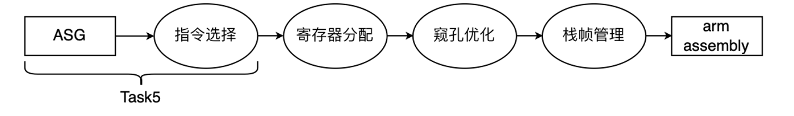
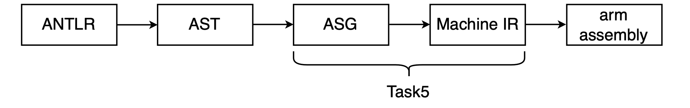
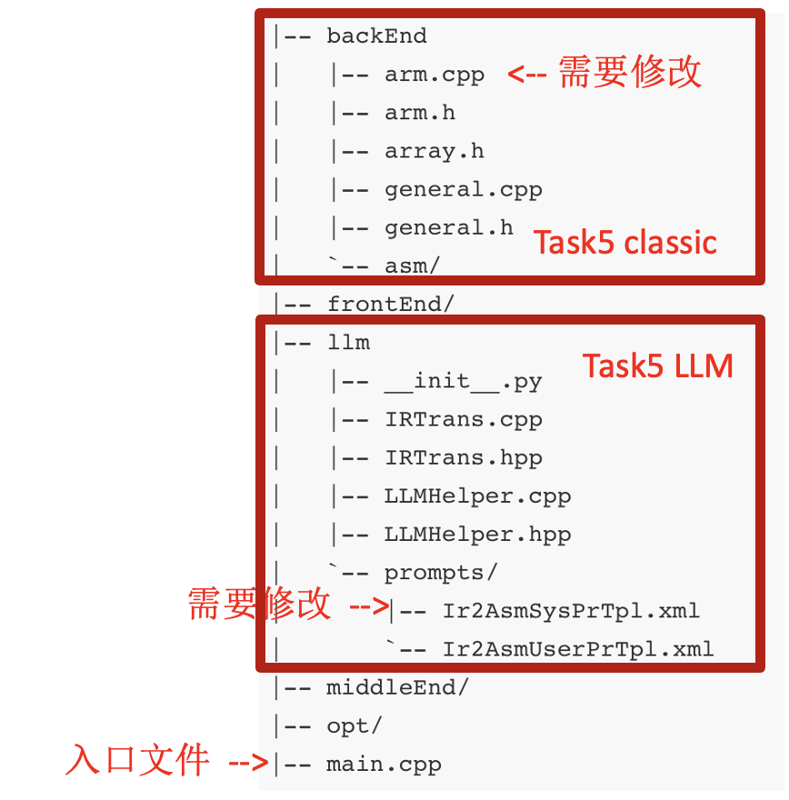

# 整体介绍

	
Task 5 · 目标代码生成 / Code Generation

	
&quot;To understand a program you must become both the machine and the program.&quot;

	
（要理解一个程序，你必须同时成为机器和程序本身。）

	
Alan Perlis

!!! note "这是从 IR 走向机器世界的一步"

		Task5 更像一次收束：前端和中端产出的结构，会在这里被翻译为真正贴近硬件的表示。
		无论你选择 Classic 还是 LLM 路线，都建议先把整体流水线看通，再进入局部实现。

恭喜同学们完成前四个实验，在实验一到四中，同学们已经分别完成了词法分析器，语法分析器，中间代码生成器以及中间代码优化器。在前四个实验中，同学们已经完成了编译器的前端和中端部分，在本次实验中，同学们将需要完成编译器的**后端指令选择**部分。

在本次实验中，有两种实现路径

!!! note "先看完整后端流水线，再决定切入点"

	如果一开始只盯着某一条指令的翻译，很容易在寄存器、控制流和调用约定之间来回迷失。
	建议先把从 IR 到 Machine IR 再到汇编的整体路径通读一遍。

- **传统方法**：补充框架代码关键逻辑，实现指令选择功能
- **大语言模型方法**：补充Prompts，引导大语言模型完成从IR到ARM汇编的转变

!!! warning "先选主路线，再安排时间投入"

	Task5 是选做实验，内容跨度也比前几题更大。开始之前先判断自己是要优先完成 Classic，还是先尝试 LLM 路线。
	不要两条线同时铺开，否则很容易两边都停在半路。

# 任务描述

## 概述

在本次实验中，同学们需要完成后端代码生成中的指令选择部分，完成IR到Machine IR的转换。

从ASG转换到ARM汇编需要很多步骤，如下图所示

需要进行指令选择转换成含虚拟寄存器的Machine IR，然后进行寄存器分配，将虚拟寄存器与实际寄存器进行绑定，然后经过窥孔优化进行一些简单的优化（强度衰减、常量折叠等），最后进行栈帧管理，用于组织局部变量、保存上下文信息等。

而指令选择是将平台无关的 LLVM IR 翻译成 平台相关的 Machine IR部分。Machin IR是在 LLVM IR 和目标机器指令之间的过渡表示，其更贴近底层硬件指令，且与平台相关，需要添加许多目标平台的特性，拥有以下特征

- 虚拟寄存器：指令操作数存放在虚拟寄存器中，通过寄存器分配后放入实体寄存器
- 平台相关性：指令的类型功能与ARM一致

在本次实验中，同学们将会用到一个针对arm v8a 32位后端的迷你编译器，编译器中已经包含了前端，中端以及后端的部分代码实现。

## 实验任务

Task5分别两个部分，Classic部分和LLM部分，在Classic部分**同学们需要编写代码，根据迷你编译器中端输出的IR，进行指令选择，将IR转换为对应于后端机器的Machine IR。**助教已经为同学们写好了寄存器分配等其他部分的代码。在LLM部分，同学们需要**编写Prompt指导LLM**，将中端输出的IR直接翻译为汇编代码。本次实验中没有标准答案，同学们可以根据IR选择认为合适的指令，也可以在汇编层面进行优化，只需要确保最后编译出来的二进制程序的正确性即可。

!!! tip "Classic 与 LLM 的共同底线都是正确性"

	不管你是手写指令选择，还是让模型生成汇编，最后都要回到同一个判断标准：程序行为是否正确。
	先把可运行、可验证的最小输出做出来，再考虑更激进的优化或更复杂的提示词。

Task5属于**选做实验，**提供额外的**10分**（可补前面扣的分，总成绩封顶100分）

### Classic实验代码流程

后端指令选择部分的代码调用逻辑是自顶向下的，最终由指令开始生成，一步步向上，到基本块再到整个函数。具体而言之，整个调用逻辑由 `emit_asm` （负责生成整个程序的asm）→ `emit_function_asm` → `emit_instruction` （不同指令有不同的emit函数）。

### Classic相关文件

同学们需要修改的是 `backend/arm.cpp`文件。补充留空的部分，具体而言之，需要补充 `emit_Move` `emit_Branch` `emit_Icmp` `emit_Binary` `emit_Return` ，已经使用注释**task5 begin**，**task5 end**将其分割。

!!! note "Classic 路线先打通最基本的控制流与返回"

	如果 `move`、分支和返回都还没稳定，后面再补比较和算术只会叠加噪声。
	建议先让最简单函数能正确落到 Machine IR，再继续扩展指令覆盖面。

### LLM相关文件

同学们需要修改的是 `llm/prompts/Ir2AsmSysPrTpl.xml`  `llm/prompts/Ir2AsmUserPrTpl.xml`文件，补充完成里面给LLM的Prompt。

!!! danger "Prompt 不要只描述结果，要约束过程"

	如果提示词只说“把 IR 翻译成汇编”，模型很容易忽略调用约定、寄存器使用和分支结构。
	更稳妥的写法是把输入格式、输出格式、关键约束和禁止行为都写清楚。

